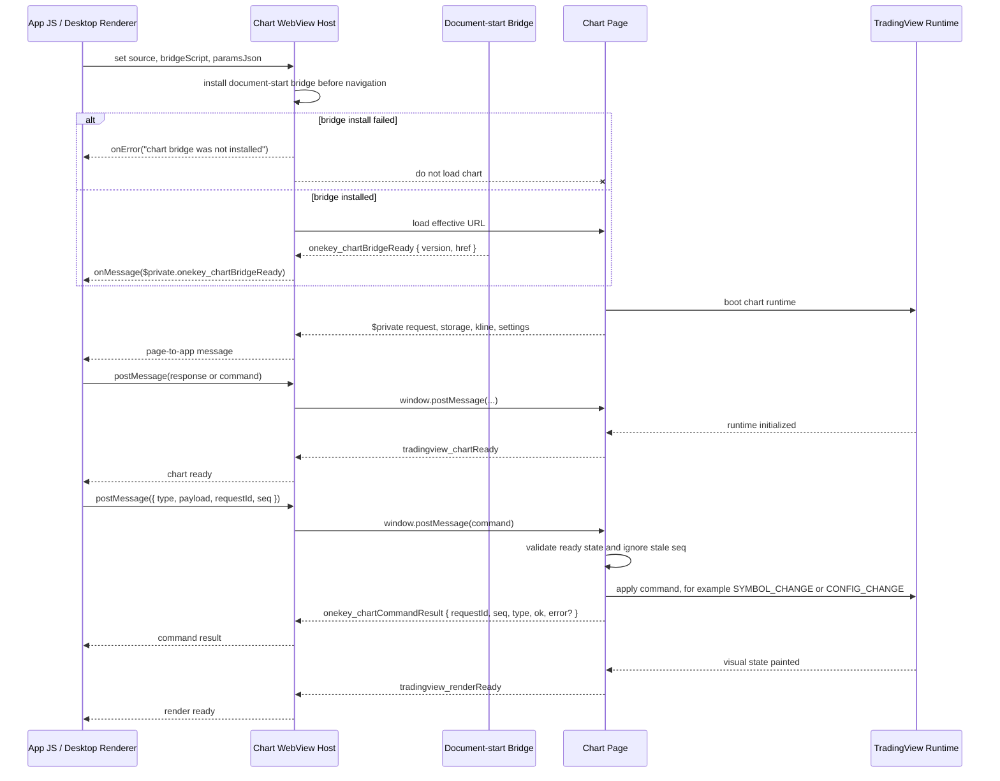
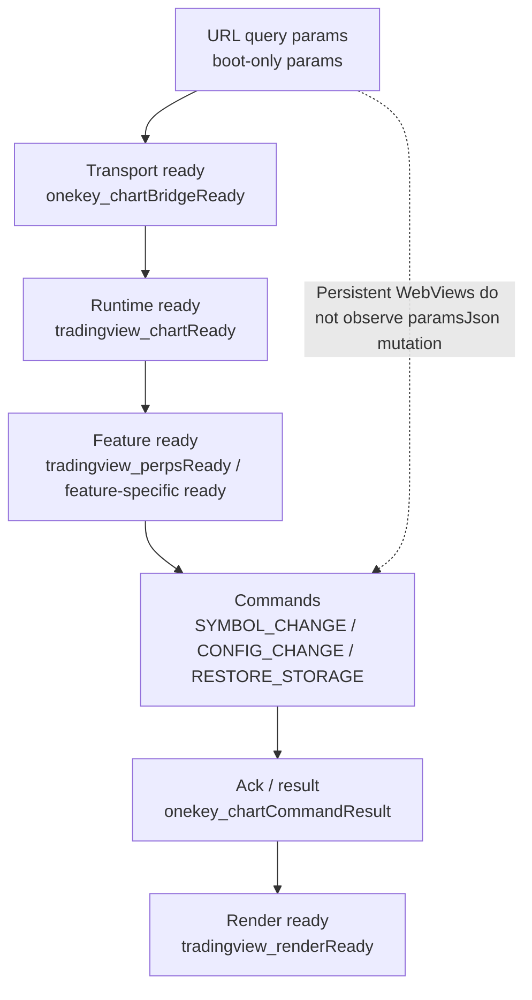

# OneKey Chart WebView Standard (OCWS)

- **Version:** 1.0
- **Status:** Active
- **Last updated:** 2026-07-03
- **Applies to:** every implementation of OneKey's chart WebView host: iOS
  (Swift + WKWebView), Android (Kotlin + WebView/WebViewAssetLoader), desktop
  equivalents in app-monorepo (Electron `<webview>` + privileged protocol), the
  React Native JS wrapper, and product-level chart integrations.

This document defines the behavior expected from the chart WebView host. The
module is deliberately a thin WebView container plus message pipe. TradingView
business logic, symbol routing, kline fetches, build-time asset fetching, and
screen-specific prewarm policy live in app-monorepo.

When an implementation and this document disagree, the implementation is at
fault unless the difference is explicitly documented in the "Known gaps" section.

Normative language:

- `MUST`, `MUST NOT`, `REQUIRED`, and `SHALL` define mandatory requirements.
- `SHOULD` defines a strong recommendation. Any exception MUST be documented
  with a platform reason and accepted by review.
- `MAY` defines optional behavior.

---

## 1. Purpose & scope

The chart WebView host provides a reusable, low-latency host for the OneKey
TradingView chart. It has four responsibilities:

- load either a remote chart URL or an app-bundled offline chart bundle,
- inject a document-start bridge so the page can call back into app JS,
- expose an imperative `postMessage` / `reload` surface to app JS,
- optionally keep one warm WebView per reuse key and reparent it across screens
  without reloading.

**In scope:** source selection, offline virtual-origin serving, query-parameter
encoding, bridge injection, message routing, WebView pooling, ownership
arbitration, snapshot masking, debug toggles, load/error events, native cleanup,
and platform equivalence.

**Out of scope:** choosing chart symbols, TradingView protocol semantics,
fetching the private chart bundle, copying assets into mobile apps or desktop
asar, kline caching, perps lines, chart settings migration, React Navigation
prewarm policy, and any general-purpose browser behavior.

This module MUST NOT be treated as a general-purpose WebView. When the privileged
chart bridge is enabled, callers MUST load only trusted OneKey chart pages or the
app-bundled chart bundle.

---

## 2. Architecture

```
  app-monorepo chart integration
        |
        | props + callbacks + imperative ref
        v
  +--------------------- Chart WebView Host ----------------------+
  |                                                              |
  |  JS wrapper                                                   |
  |    - defaults bridgeScript to CHART_BRIDGE_JS                 |
  |    - wraps Nitro callbacks                                    |
  |    - exposes ChartWebviewView                                 |
  |                                                              |
  |  Native host view                                             |
  |    - owns a lightweight container                             |
  |    - claims/releases a backing WebView                        |
  |    - routes page events to the active owner or warm driver     |
  |                                                              |
  |  Backing WebView                                              |
  |    - remote URL or offline local bundle                       |
  |    - document-start bridge                                    |
  |    - snapshot/reparent masking                                |
  |    - optional shared pool keyed by reuseKey                    |
  |                                                              |
  +--------------------------------------------------------------+
        |
        v
  TradingView page
```

The app integration is responsible for passing a stable source when reload-free
switching is desired. The host preserves a WebView only when the effective URL is
unchanged; it does not understand symbols or TradingView state.

---

## 3. Public API contract

### 3.1 React component

```ts
export function ChartWebviewView(props: ChartWebviewViewProps): ReactElement;
```

The JS wrapper MUST default `bridgeScript` to `CHART_BRIDGE_JS` so normal callers
do not need to know about the transport bridge. Callers MAY override
`bridgeScript` for tests or controlled experiments, but production integrations
SHOULD use the default shared bridge.

Nitro callback props MUST be wrapped using `callback()` by the JS wrapper, and
the wrapper MUST keep the outer React callbacks fresh without forcing native
callback identity churn.

### 3.2 Props

```ts
export interface ChartWebviewProps extends HybridViewProps {
  uri?: string;
  localBundle?: string;
  entry?: string;
  paramsJson?: string;
  assetHost?: string;
  bridgeScript?: string;
  reuseKey?: string;
  pooled?: boolean;
  active?: boolean;
  webviewDebuggingEnabled?: boolean;
  onMessage?: (message: string) => void;
  onLoadEnd?: () => void;
  onError?: (message: string) => void;
}
```

Source props:

- `uri` is a remote URL. When it is a non-empty string, remote mode wins.
- `localBundle` is the app-bundled folder name used for offline mode.
- `entry` is the bundle entry document. The default is `index.html`.
- `paramsJson` is a JSON object string converted into the entry query string.
- `assetHost` is Android-only. It is a bare hostname used as the offline HTTPS
  asset origin. iOS ignores it.

Bridge props:

- `bridgeScript` is the document-start JS installed into the chart page.
  Empty or missing bridge scripts MUST block local page boot until a non-empty
  bridge is available, otherwise early `$private` requests can be lost.

Pooling props:

- `pooled: true` plus a non-empty `reuseKey` enables shared backing WebView mode.
- `active` selects the visible owner among hosts with the same `reuseKey`.
  `undefined` is treated as active. This prop is intentionally not named
  `isActive`, because Kotlin/Nitro accessor generation can otherwise drift.

Debug props:

- `webviewDebuggingEnabled` requests WebView inspection. iOS applies this per
  WKWebView where supported. Android can only enable debugging process-wide and
  cannot turn it back off during the same process lifetime.

Event props:

- `onMessage` receives raw page-to-native message strings.
- `onLoadEnd` fires when the top-level chart page finishes loading.
- `onError` fires for invalid URLs or main-frame WebView load failures.

### 3.3 Methods

```ts
export interface ChartWebviewMethods extends HybridViewMethods {
  postMessage(message: string): void;
  reload(): void;
  clearSnapshot(): void;
}
```

- `postMessage(message)` sends app JS data into the page using
  `window.postMessage(...)`. `message` MUST be a JSON string for cross-platform
  equivalence.
- `reload()` reloads the current backing WebView.
- `clearSnapshot()` removes the cached frame used to hide reparent flashes and
  frees the platform snapshot where possible.

---

## 4. Source modes

Exactly one effective source mode is active per backing WebView.

### 4.1 Remote mode

Remote mode is selected when `uri` is non-empty. The host navigates directly to
that URL and MUST NOT rewrite it.

Callers MUST only use remote mode with trusted chart origins when the default
privileged bridge is injected. Android scopes the bridge to the remote URL origin
and the configured offline asset origin. iOS currently scopes the bridge to the
main frame, not to a specific origin, so the trust boundary is enforced by the
caller.

### 4.2 Offline mode

Offline mode is selected when `uri` is empty or absent and `localBundle` is
non-empty.

The final offline URL is platform-specific:

| Platform | Effective origin | Entry URL shape |
| --- | --- | --- |
| iOS | `onekey-chart://chart` | `onekey-chart://chart/<entry>?<params>` |
| Android default | `https://appassets.androidplatform.net` | `https://appassets.androidplatform.net/<localBundle>/<entry>?<params>` |
| Android with `assetHost` | `https://<assetHost>` | `https://<assetHost>/<localBundle>/<entry>?<params>` |
| Desktop equivalent | `onekey-chart://local` | `onekey-chart://local/index.html?<params>` |

The offline origin MUST be a secure, stable virtual origin. Implementations MUST
NOT load the bundle through `file://`, because `file://` creates an opaque/null
origin and breaks CORS-sensitive `fetch()` / WebSocket paths.

### 4.3 Query params

`paramsJson` MUST parse as a JSON object. Invalid or empty JSON resolves to an
empty query string. Values are serialized as strings. Implementations MUST URL
encode keys and values.

Query parameter order MUST NOT be semantically significant. Current iOS sorts
pairs, while Android follows `JSONObject` key iteration.

### 4.4 URL dedupe

The backing WebView MUST load only when the effective target URL changes. Prop
re-application, reparenting, focus changes, and repeated identical sources MUST
NOT trigger a reload.

---

## 5. Offline asset serving

### 5.1 iOS

iOS serves offline assets through `WKURLSchemeHandler` registered for
`onekey-chart`.

- `localBundle` resolves under `Bundle.main.resourceURL/<localBundle>/`.
- Requests MUST be path-traversal guarded after URL normalization.
- Missing files MUST return a 404 response, not crash the host.
- Responses SHOULD include a correct MIME type for html, js, mjs, css, json,
  wasm, fonts, images, svg, ico, and text.
- The handler MAY include permissive CORS headers for bundle resources.

### 5.2 Android

Android serves offline assets through `WebViewAssetLoader`.

- `localBundle` resolves under APK assets as `assets/<localBundle>/`.
- The registered path handler MUST be narrowed to `/<localBundle>/`, not `/`, so
  an `assetHost` that is also a real public domain does not shadow every path on
  that domain.
- The handler MUST re-prepend the bundle namespace before delegating to the
  asset loader, so entry-relative assets still resolve under
  `assets/<localBundle>/`.
- `assetHost` MUST be sanitized as a bare hostname. Values with a scheme, path,
  userinfo, whitespace, query, port, or malformed host MUST fall back to
  `appassets.androidplatform.net`.

### 5.3 Desktop equivalent

The desktop implementation in app-monorepo is not part of the native module, but
it is a behavioral equivalent for Electron:

- the chart bundle is staged into `apps/desktop/app/tradingview-assets/`,
- electron-builder includes `tradingview-assets/**/*` in the asar outside
  renderer `build/`,
- the main process registers `onekey-chart` as a privileged `standard` and
  `secure` scheme before `app.ready`,
- the `persist:onekey` webview session registers a protocol handler only when
  `tradingview-assets/index.html` exists,
- requests map `onekey-chart://local/<path>` to the asar asset root with
  path-traversal guards,
- the renderer reads `tradingViewOfflineReady` from desktop globals and falls
  back to the online chart when the bundle is absent.

---

## 6. Message bridge

### 6.0 Protocol overview

GitHub renders the following Mermaid diagrams in Markdown. They are protocol
overview diagrams; the normative requirements are still defined by the text in
the subsections below.





### 6.0.1 Implementation ownership

The communication stack has three layers. Specs and reviews SHOULD identify
which layer a change belongs to before implementation:

| Layer | Responsibility | Local implementation |
| --- | --- | --- |
| Transport bridge | Exposes page-to-host and host-to-page message pipes; owns document-start timing, origin scoping, owner/warm-driver routing, and same-URL reload dedupe. It MUST NOT know chart business commands. | `native-views/react-native-chart-webview/src/bridge.ts`, `ios/ChartWebview.swift`, `android/src/main/java/com/margelo/nitro/chartwebview/PooledChartWebView.kt` |
| Desktop equivalent transport | Provides the Electron equivalent of document-start injection and message routing. This lives outside the native module but must match the same timing and fail-closed behavior. | `app-monorepo/packages/kit/src/components/WebView/DesktopWebView.tsx` plus `preload.js` or chart-only `desktop-chart-preload.js` selected by WebView preload kind |
| Chart app-layer protocol | Defines chart-specific commands, readiness states, request/result semantics, and idempotency rules such as `SYMBOL_CHANGE`, `CONFIG_CHANGE`, `RESTORE_STORAGE`, and `onekey_chartCommandResult`. | `app-monorepo/packages/kit/src/components/TradingView/**` and the TradingView chart page bundle |

Native iOS/Android and the desktop WebView host implement only the transport
contract. Chart-specific command handling belongs to the app-layer protocol and
the chart page. For example, `onekey_chartBridgeReady` is a transport signal,
while `tradingview_chartReady`, `tradingview_perpsReady`, `SYMBOL_CHANGE`, and
`onekey_chartCommandResult` are chart protocol signals.

### 6.0.2 Desktop preload strategy

Desktop has two possible transport implementations:

| Strategy | Intended use | Tradeoff |
| --- | --- | --- |
| Generic dapp preload | Discovery / dapp WebViews that need the full OneKey inpage provider and wallet bridge. | Reuses mature infrastructure, but loads a broad provider surface and a large preload into a first-party chart page. |
| Lightweight chart preload | First-party TradingView chart WebViews that only need `$private` page-to-app requests, `window.postMessage` app-to-page commands, and chart transport readiness. | Smaller and narrower trust boundary, but needs a dedicated desktop chart transport implementation and tests. |

The generic dapp preload returned by `DesktopApiWebview.getPreloadJsContent()`
is acceptable as a compatibility transport, but it is heavier than the chart
needs and SHOULD NOT be treated as the long-term target for chart-only WebViews.

The desktop chart-only transport SHOULD use the dedicated lightweight preload
named `desktop-chart-preload.js`, returned by
`DesktopApiWebview.getChartPreloadJsContent()` and selected explicitly with
`preloadKind: EDesktopWebViewPreloadKind.Chart`. This preload implements only
this contract:

- define `window.__chartNativePost(payloadString)` at preload/document-start
  time,
- expose `window.$onekey.$private.request(payload)` by forwarding to
  `window.__chartNativePost`,
- expose `window.ReactNativeWebView.postMessage(value)` only for chart transport
  compatibility,
- forward `window` `message` events where `data.scope === '$private'`,
- emit `onekey_chartBridgeReady` immediately after installation,
- use the same page-to-app routing, origin validation, and fail-closed behavior
  as the generic desktop transport.

The lightweight chart preload MUST NOT inject wallet providers such as
`ethereum`, `solana`, chain-specific providers, floating dapp UI, clipboard
overrides, or unrelated discovery/dapp features. It MAY coexist with the generic
preload through an explicit desktop WebView option backed by
`EDesktopWebViewPreloadKind` (`Dapp`, `Chart`, `None`), defaulting to the
existing generic dapp preload for non-chart callers.

### 6.1 Document-start bridge

The shared JS bridge MUST run at document start before the chart page code. It
defines or uses one platform hook:

```js
window.__chartNativePost(payloadString)
```

The shared bridge MUST forward all supported outbound channels to that hook:

- `window.$onekey.$private.request(payload)`
- `window.ReactNativeWebView.postMessage(value)`
- `window` `message` events whose `data.scope === '$private'`

The bridge MUST be idempotent and MUST NOT install duplicate handlers if the
page evaluates it more than once.

Implementations MUST install this bridge before the first chart navigation starts.
If a platform cannot install a document-start bridge, it MUST fail closed and
surface an error instead of loading the chart with a late or missing bridge.
`onPageFinished`, `did-finish-load`, `dom-ready`, and equivalent post-load
injection points MUST NOT be used as the primary bridge install path.

The bridge MUST emit one transport-ready control message as soon as it is
installed:

```json
{
  "scope": "$private",
  "method": "onekey_chartBridgeReady",
  "data": {
    "version": 1,
    "href": "<current page url>"
  }
}
```

This message proves only that the native transport bridge exists. It does not
mean the TradingView app, datafeed, symbol listener, or render pipeline is ready.

### 6.2 Platform transport shim

The native layer owns only the small platform shim:

- Android exposes `AndroidChartBridge.postMessage(s)` through
  `addJavascriptInterface`, and document-start JS calls it from
  `window.__chartNativePost`.
- iOS exposes `window.webkit.messageHandlers.onekeyChart.postMessage(s)` through
  `WKScriptMessageHandler`, and document-start JS calls it from
  `window.__chartNativePost`.

### 6.3 Page to app

Page messages MUST be routed to the current visible owner. If no owner exists
but a warm driver exists, messages MUST be routed to the warm driver so prewarm
loads do not drop early chart data requests.

The native module MUST deliver page messages as raw strings. Product code MAY
parse them and wrap them into legacy `{ data: payload }` envelopes.

### 6.4 App to page

`postMessage(message)` MUST dispatch to the page as `window.postMessage(...)`.
For cross-platform behavior, callers MUST pass a JSON string. Product-level
TradingView messages such as `SYMBOL_CHANGE`, `RESTORE_STORAGE`, perps line
sync, or websocket recovery are app-layer protocol messages and are out of scope
for the native module.

### 6.5 App-layer protocol recommendations

The chart page and app SHOULD use a small, explicit message protocol on top of
the raw transport. Existing integrations already use two envelope shapes:

Page to app:

```ts
type ChartPageMessage = {
  scope: '$private';
  method: string;
  data?: unknown;
  requestId?: string;
};
```

App to page:

```ts
type ChartAppCommand = {
  type: string;
  payload?: unknown;
  requestId?: string;
  seq?: number;
};
```

Recommended lifecycle signals:

- `onekey_chartBridgeReady`: transport bridge installed at document start.
- `tradingview_chartReady`: chart runtime has initialized enough to accept
  general commands.
- domain-specific ready messages such as `tradingview_perpsReady`: a feature
  listener is ready to accept its own commands.
- `tradingview_renderReady`: the requested visual state has painted and native
  snapshot overlays may be removed.

Commands that have observable side effects SHOULD include `requestId` or `seq`.
The page SHOULD reply with either a command-specific result method or a generic
result envelope:

```ts
type ChartCommandResult = {
  scope: '$private';
  method: 'onekey_chartCommandResult';
  data: {
    requestId?: string;
    seq?: number;
    type: string;
    ok: boolean;
    error?: string;
  };
};
```

Idempotent commands such as `SYMBOL_CHANGE` MAY be sent eagerly before a
feature-ready signal, but the app MUST re-assert them after the relevant ready
signal and the page MUST ignore stale or duplicate commands.

### 6.6 URL params and persistent WebViews

URL query params are boot parameters. A persistent or pooled WebView does not
observe React prop changes to `paramsJson` unless those changes produce a new
effective URL and the host intentionally reloads the page.

Therefore:

- values that can change during the lifetime of a warm WebView MUST be sent as
  messages, not only as URL params,
- a reload-free unified source MUST keep its effective URL stable and move
  dynamic state such as symbol, source, display labels, perps lines, and account
  scoped data through app-to-page commands,
- changing query params is a reload boundary, not a live update mechanism,
- if the chart page needs live config updates, define an explicit command such
  as `CONFIG_CHANGE` and an ack/result message.

---

## 7. Pooling and ownership

### 7.1 Pool identity

When `pooled === true` and `reuseKey` is non-empty, all hosts with the same key
share one backing WebView. Otherwise each host owns a private backing WebView.

Pool entries are created on first use. They are kept warm by default even after
the last host releases them. Implementations MAY add LRU or explicit eviction,
but eviction MUST destroy the backing WebView cleanly.

### 7.2 Claiming

A host wants ownership when:

```ts
attachedToWindow && active !== false
```

The active host MUST claim and attach the shared backing WebView to its
container. Inactive hosts MUST yield ownership and keep a placeholder snapshot
when one is available.

Prop updates in one React commit arrive one by one, so native implementations
MUST coalesce ownership reconciliation to avoid transient wrong-owner claims.

### 7.3 Warm driver

A pooled host with a non-empty bridge script and source MUST be allowed to warm
boot the backing page even when it is not the visible owner. That host becomes
the `warmDriver` and receives load/messages while no owner is visible.

This is required for prewarm screens: the page must load and service initial
`$private` requests before a real chart screen is focused.

### 7.4 Private mode

Private, non-pooled hosts own their backing WebView exclusively. When the host
is destroyed, the backing WebView MUST be destroyed rather than kept warm.

---

## 8. Snapshot and reveal behavior

Reparenting a native WebView can briefly show a blank frame. Implementations
MUST mask this where possible:

- capture a recent frame while the host owns the WebView,
- show that frame as an overlay during reparenting,
- remove the overlay shortly after attach,
- maintain a per-host snapshot so inactive hosts do not show another screen's
  chart content.

When a host becomes active with an existing snapshot, it SHOULD hold that
snapshot until the chart reports that the new content rendered. The current
render-ready marker is the substring:

```text
tradingview_renderReady
```

Implementations MUST include a fallback reveal timeout so a missed render-ready
message cannot leave the chart permanently covered. Current timeout: 2 seconds.

Android MUST capture GPU-rendered chart pixels with `PixelCopy` rather than a
software `View.draw()` path. Implementations SHOULD recycle unused bitmaps.

---

## 9. Lifecycle and cleanup

### 9.1 iOS

iOS MUST:

- remove the WebView from its old parent before attaching to a new container,
- remove overlays and cached snapshots on destroy/clear,
- stop loading and nil delegates on destroy,
- remove the script message handler and user scripts on destroy,
- balance pool refcounts on host deinit,
- serialize pool dictionary access.

### 9.2 Android

Android MUST:

- use a teardown-aware view manager so `onDropViewInstance` calls host dispose,
- detach a pooled WebView from a dropped host container if it is still parented
  there,
- force-detach from stale parents where normal `removeView()` is deferred,
- destroy private WebViews on host dispose,
- remove document-start scripts, overlays, snapshots, and destroy the WebView on
  backing destroy,
- pause an idle shared WebView after it has loaded and nobody owns it, then
  resume it on the next claim. This MUST use per-instance `onPause()` /
  `onResume()`, not process-global timer APIs.

---

## 10. Debugging

`webviewDebuggingEnabled` is a request, not a full symmetric toggle.

- iOS 16.4+ applies `WKWebView.isInspectable`. `nil` defaults to DEBUG builds
  being inspectable and release builds not being inspectable.
- Android calls `WebView.setWebContentsDebuggingEnabled(true)` only when the
  prop is explicitly true. This is process-global and cannot be reliably turned
  off until process restart.

---

## 11. App-monorepo integration requirements

The native module is the transport. App-monorepo owns the chart product policy.
A conforming app integration SHOULD provide:

- build-time fetching of `@onekeyhq/tradingview-charting-library`,
- copy/staging into mobile app resources or desktop asar,
- a code-level source mode switch such as `legacy` / `offline` / `online`,
- online fallback when offline assets are absent,
- stable unified source URLs when reload-free symbol switching is desired,
- symbol switching through app-layer messages such as `SYMBOL_CHANGE`,
- kline/data request handling through the existing chart `$private` bridge,
- per-domain or per-scene storage namespace policy,
- prewarm policy tied to navigation/focus,
- desktop session partition policy.

PR `OneKeyHQ/app-monorepo#11922` implemented the broad product integration:

- mobile offline bundle pipeline and native chart host usage,
- desktop `onekey-chart://local` protocol serving,
- unified source plus `SYMBOL_CHANGE` switching,
- native prewarm and predicted-symbol flow,
- desktop in-flow warm chart host,
- explicit packaging boundary where chart assets ship in native apps/desktop
  installers but not JS hot-update bundles.

The local `codex/desktop-chart-offline` worktree is a narrower desktop
equivalent:

- it restores desktop bundle fetching and `onekey-chart://local` serving,
- it routes existing TradingView URLs to the offline base when desktop globals
  report readiness,
- it adds chart localStorage migration from the old online origin to the new
  offline origin,
- it does not include the PR's mobile native `ChartWebView` integration,
  native prewarm, predicted-symbol flow, or desktop constant unified in-flow
  chart host.

---

## 12. Security requirements

- The default privileged bridge MUST be injected only into trusted chart content.
- Android document-start scripts MUST be origin-scoped to the trusted offline
  origin and, in remote mode, the trusted remote chart origin.
- iOS bridge injection is main-frame-only; therefore callers MUST NOT load
  arbitrary untrusted top-level pages with the default bridge.
- Offline asset serving MUST prevent path traversal.
- Android `assetHost` MUST be sanitized before becoming both a trusted bridge
  origin and a `WebViewAssetLoader` domain.
- Desktop protocol handlers MUST reject unexpected hosts and path traversal.
- Missing assets MUST fail closed with 404 or online fallback at the app layer;
  they MUST NOT load `file://` as a fallback.
- Logs SHOULD avoid full sensitive message bodies and URLs that may contain
  tokens. Native lifecycle logs may truncate payloads.

---

## 13. Known gaps and current differences

These are current implementation boundaries, not desired long-term behavior:

- The current native module does not expose `fallbackUri`. PR #11922's app-layer
  comments mention passing `fallbackUri`, but the local native API and native
  implementations do not honor it.
- Native JS currently cannot detect whether a mobile offline bundle exists.
  Mobile asset absence must be handled by build configuration or a future native
  readiness API.
- iOS does not support Android's `assetHost` behavior. It always serves offline
  content from `onekey-chart://chart`.
- Android `webviewDebuggingEnabled: false` cannot disable debugging once any
  WebView has enabled process-global debugging.
- Native unified single-pool mode shares a boot-time storage namespace across
  market and perps if the source must be byte-identical. Desktop can isolate
  namespaces when it uses separate in-flow WebViews per domain.
- The native module does not implement TradingView storage migration. The local
  desktop worktree implements migration in app-monorepo through hidden WebViews
  and a `RESTORE_STORAGE` app-layer message.

---

## 14. Current conformance matrix

This matrix records the current local implementation status. `Implemented`
means the platform satisfies the requirement in this spec. `Partial` means the
transport or host behavior exists but a product-level chart integration still
needs to adopt the app-layer convention.

| Requirement | iOS native host | Android native host | Desktop equivalent | Status |
| --- | --- | --- | --- | --- |
| Document-start bridge before page code | Uses `WKUserScript` with `.atDocumentStart`; `setSource` blocks until the bridge is registered. | Uses `WebViewCompat.addDocumentStartJavaScript(...)` before `loadUrl`. | Uses Electron `<webview preload=...>`; the local desktop worktree waits for preload URL resolution before creating `<webview>`. | Implemented |
| Fail closed when a document-start bridge cannot be installed | `WKUserScript` is the platform document-start API; empty scripts block load until a script arrives. | Fails and dispatches `onError` if `DOCUMENT_START_SCRIPT` is unavailable or the bridge/origins are missing. | Does not mount a bridged `<webview>` until preload is available. | Implemented |
| Origin-scoped privileged bridge | Main-frame-only `WKUserScript`; caller trust-gates top-level URL. | Scopes document-start script to the offline asset origin plus remote chart origin. | `DesktopWebView` validates the reported origin against the current `<webview>` URL, including custom-scheme origins such as `onekey-chart://local`. | Implemented with platform-specific boundaries |
| Transport-ready control message | Shared `CHART_BRIDGE_JS` emits `onekey_chartBridgeReady`. | Shared `CHART_BRIDGE_JS` emits `onekey_chartBridgeReady`. | `desktop-chart-preload.js` emits `onekey_chartBridgeReady`; generic dapp preload is compatibility-only for chart pages. | Implemented for chart preload |
| App-to-page command transport | `postMessage` dispatches `window.postMessage(...)`. | `postMessage` dispatches `window.postMessage(...)`. | `sendMessageViaInjectedScript` posts to `window.postMessage(...)`. | Implemented |
| Page-to-app command transport | `$private` / ReactNativeWebView / `message` events route to native owner or warm driver. | `$private` / ReactNativeWebView / `message` events route to native owner or warm driver. | `desktop-chart-preload.js` forwards `$private`, ReactNativeWebView, and `$private` `message` events to `JsBridgeDesktopHost` through Electron `ipc-message`. | Implemented |
| Command ack/result envelope | Spec defines `onekey_chartCommandResult` recommendation. | Spec defines `onekey_chartCommandResult` recommendation. | Spec defines `onekey_chartCommandResult` recommendation. | Partial: chart bundle/app-layer adoption required |
| URL params are boot parameters | `paramsJson` changes affect the effective URL; same URL is deduped. | `paramsJson` changes affect the effective URL; same URL is deduped. | TradingView URL hooks compute a final URL; persistent webviews only see new params through reload or app-layer messages. | Implemented |
| Reload-free dynamic chart state | Host preserves WebView when effective URL is unchanged; app must use messages for dynamic state. | Host preserves WebView when effective URL is unchanged; app must use messages for dynamic state. | Local worktree has message-based perps symbol sync; broader PR #11922 used unified source plus `SYMBOL_CHANGE`. | Partial by product integration |
| Same-URL no reload | `lastLoadedUrl` dedupe. | `lastLoadedUrl` dedupe. | React source/preload identity is preserved unless `src` changes or caller reloads. | Implemented |

## 15. Conformance checklist

A chart WebView implementation is conformant when it satisfies all mandatory
requirements below:

- Remote mode loads `uri` directly.
- Offline mode serves bundled assets from a secure virtual origin, never
  `file://`.
- Query params are built from `paramsJson` with URL encoding.
- Loading is deduped by effective URL.
- Document-start bridge is installed before chart page code runs.
- The implementation fails closed instead of loading when document-start bridge
  installation is unavailable.
- The bridge emits `onekey_chartBridgeReady` after installation.
- Page-to-native channels route through `window.__chartNativePost`.
- App-to-page messages use `window.postMessage`.
- Dynamic warm-WebView state changes are sent by messages, not by relying on
  query-param mutation.
- Pooled hosts with the same `reuseKey` share one backing WebView.
- Ownership is controlled by window attachment plus `active`.
- Warm driver receives early load/messages when no visible owner exists.
- Private backing WebViews are destroyed on host teardown.
- Pooled backing WebViews can be detached from stale/dropped parents.
- Snapshot masking prevents blank frames during reparent where the platform
  allows.
- `clearSnapshot()` removes visible overlays and frees cached snapshots where
  possible.
- Debugging toggles follow the platform constraints in this spec.
- Offline asset handlers prevent path traversal and return 404 for misses.
- The implementation documents any platform-specific degradation.
