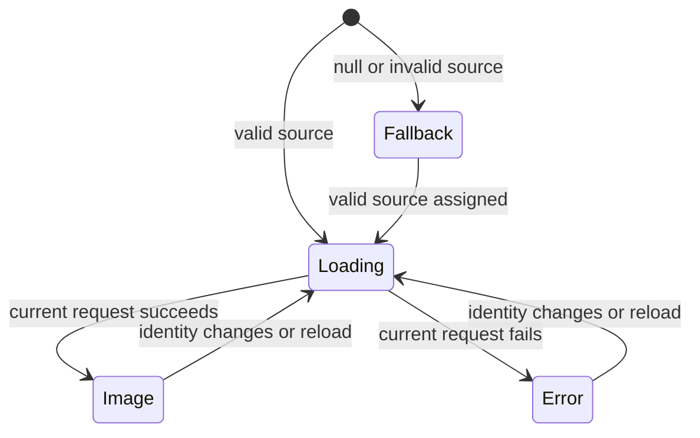

# Native Image Spec

## 1. Implementation status and authority

This document is the behavioral contract for
`@onekeyfe/react-native-image`. iOS uses SDWebImage and Android uses Glide; their
cache keys, decode pipelines, and callbacks are independent. This spec names the
shared semantics and records deliberate differences so they remain visible in
review.

All functionality defined by this spec is implemented. The table below records
implementation status only; validation evidence is tracked separately in §11.

| Area                                                     | Implementation status          |
| -------------------------------------------------------- | ------------------------------ |
| Public TypeScript API and native bridge                  | Implemented                    |
| Loading, fallback, cancellation, and recycling ownership | Implemented on iOS and Android |
| Decode and encoded-data safety limits                    | Implemented on iOS and Android |
| TOS rendition selection                                  | Implemented on iOS and Android |
| Synchronous memory probe and cross-size preview          | Implemented on iOS and Android |

## 2. Scope and non-goals

OneKeyImage owns source normalization, native request execution, decoding,
display state, native loading/fallback presentation, cache operations, request
cancellation, and safe reuse of a native view.

It supports URI sources and React Native numeric assets resolved to a URI. It
provides a React wrapper, a Nitro native view, cache/preload methods, and a
native-only reusable host for native list cells.

The component does not own application image selection, authentication token
refresh, business placeholders, list identity, or layout size. Callers must
provide stable dimensions and a `recyclingKey` when a view is reused for
different logical content.

## 3. Definitions and ownership

- **Raw URL:** the caller-provided source before TOS optimization.
- **Request URL:** the optimized rendition URL, or the raw URL when optimization
  is disabled, unsafe, unsupported, or retried after an ordinary optimized-load
  failure.
- **Exact memory hit:** a decoded memory entry whose request URL and requested
  decode dimensions match the current request identity.
- **Cross-size preview:** a decoded static image from the same family at another
  compatible size, displayed temporarily while the exact request continues.
- **Family:** raw URL plus canonical request-header digest. Different headers
  never share a family.
- **Variant:** a request URL and decode width/height. Android also includes the
  circular transform because Glide caches transformed resources.
- **Terminal request:** the current request generation that exclusively owns
  `onLoad` or `onError`, followed by `onLoadEnd`.

SDImageCache and Glide remain authoritative for cached resources. The
cross-size registry stores bounded hints that reproduce cache keys; it does not
own image bytes and a stale hint is removed after a memory miss.

## 4. Public contract

### 4.1 Source and display props

| Input                         | Contract and default                                                                                                                                   |
| ----------------------------- | ------------------------------------------------------------------------------------------------------------------------------------------------------ |
| `source`                      | URI source or numeric React Native asset. Null, blank, or unresolved input shows fallback without `onError`.                                           |
| `variant`                     | `generic` by default; also `token`, `network`, and `avatar`. Selects native placeholder/fallback presentation, not cache identity.                     |
| `contentFit`                  | `cover` by default; also `contain`, `fill`, and `center`. Affects display and decode sizing.                                                           |
| `cachePolicy`                 | Explicit prop, then source-level value, with `memory-disk` as the final default.                                                                       |
| `autoplay`                    | Defaults to `false` on Android and `true` on other native platforms. Callers requiring parity must pass it explicitly.                                 |
| `recyclingKey`                | Part of request generation/signature. A change cancels stale work and resets ownership.                                                                |
| `optimizeTos`                 | `true` by default. It may replace eligible OneKey asset URLs with a bounded rendition URL.                                                             |
| `resizeWidth`, `resizeHeight` | Optional logical-size hints used by preload, TOS selection, and pre-layout memory probing. One dimension alone implies a square preload decode target. |
| `overscan`                    | `1.1` by default. Values below 1 are normalized by the TOS selector.                                                                                   |
| `round`                       | `false` by default. Clips the native host to an oval; Android includes its circle transform in decoded cache identity.                                 |
| `loadingStrategy`             | `static` by default; `skeleton` and `none` are supported. A React `placeholder` disables the native loading strategy for that instance.                |
| `placeholderColor`            | Optional theme-aware native color for loading and terminal native states.                                                                              |

On iOS, an explicit `round` value updates the shape while a source is active.
A native `nil` during a Fabric prop reset retains the last committed shape until
an explicit value arrives or a new source is committed after reuse. The React
wrapper supplies `false` when the prop is omitted.

React `placeholder` and `fallback` are optional overlay content. Their container
clips to the same rounded bounds as the native image and does not receive pointer
events.

### 4.2 Methods and cache API

- `reload()` invalidates the last request signature and starts the current
  source again.
- `cancel()` cancels current work, invalidates stale completions, and returns the
  view to a non-requesting loading state.
- `preload(sources)` resolves `true` only when every valid source succeeds. The
  JavaScript wrapper filters blank sources but returns `false` if any were blank.
- `clearMemory()`, `clearDisk()`, and `clearAll()` resolve only after their native
  cache work is complete. Memory clearing also clears cross-size hints.

## 5. State and event contract

The observable native states are loading, image, error, and fallback.

For a valid request, the terminal event order is:

1. `onLoadStart`
2. exactly one of `onLoad` or `onError`
3. `onLoadEnd`
4. `onDisplay` after a successful image is attached and visible in a window

`onDisplay` is not a terminal pair member and may occur later. A null source
shows fallback without a request and without `onError`.

Each source or identity change advances a native generation. Only the current
generation may mutate the view or emit terminal callbacks. Cancellation,
recycling, and disposal invalidate previous generations and release active
request, display, retry, safety, skeleton, and animation work.

A cross-size preview is presentation only. It MUST NOT emit `onLoad`,
`onError`, `onLoadEnd`, or `onDisplay`; the exact request retains callback
ownership. An iOS exact synchronous memory hit is terminal and reports
`cacheType: memory`. Android may show an exact decoded entry synchronously as a
preview, while the normal Glide request remains terminal; this is a recorded
library-level divergence rather than a different public success result.

## 6. Cache identity and synchronous memory probe

### 6.1 Exact identity

Cache identity includes the effective request URL, canonical request headers,
decode dimensions, and native decoder/transformation inputs. Request signatures
also include caller identity and layout inputs needed to prevent a recycled view
from accepting an obsolete result.

Headers are part of identity even when the URI is unchanged. TOS optimization is
disabled for requests with custom headers so an authenticated source is not
silently rewritten.

There is no fixed “three sizes per image” cache contract. TOS currently has five
layout tiers and up to two density renditions per tier. The memory-variant
registry records the variants actually requested, with a maximum of eight hints
per family.

### 6.2 Probe behavior

For `memory` and `memory-disk` policies, a prop change may probe decoded memory
synchronously on the UI thread before layout when size hints are available. No
disk or network work is allowed in this probe. Android MUST disable Glide disk
cache access for the probe and accept only a resource delivered synchronously
from decoded memory.

The probe order is:

1. Exact optimized request URL and dimensions.
2. Exact raw-URL fallback and dimensions when different.
3. The smallest cached variant at least as large in both dimensions.
4. The largest cached variant at most as large in both dimensions.

Cross-size candidates must belong to the same family and their aspect-ratio
drift must be at most 1.1. Animated resources are excluded. On Android, a square
target cannot reuse a circle-cropped bitmap; a circular target may reuse an
uncropped bitmap because the host clips it.

An approximate hit remains visible as the loading placeholder until the exact
request replaces it. This avoids a blank or skeleton frame while preserving the
quality and event semantics of the exact request. A cross-size preview for
`contentFit: center` is temporarily rendered with aspect-fit scaling so a
smaller image fills the intended visual area and a larger image is not clipped.
The cached bitmap is not resampled or copied. The exact image restores `center`
and replaces the preview in the same UI-thread delivery. Replacing a visible
preview MUST NOT run a whole-view fade that makes the preview disappear first.

Terminal error or fallback, cancellation, recycling, and disposal release
preview ownership. A later request for the same family may probe memory again.
`disk` and `none` policies do not participate in synchronous previews.

The registry is bounded to 1,024 families and eight variants per family. Family
access is recency-ordered; new variants evict the oldest retained hints. A cache
miss removes the stale variant immediately.

## 7. TOS rendition and decode contract

Eligible hosts are limited to OneKey's declared asset domains. Optimization is
skipped for SVG/video paths, protected or signed queries, custom request headers,
invalid sizes, and non-allowlisted hosts. Ordinary failure of an optimized URL
may retry the raw URL; a safety rejection MUST NOT bypass its limit by retrying.

| Maximum logical edge | Standard rendition | High-density rendition |
| -------------------: | -----------------: | ---------------------: |
|                   48 |                 96 |                    160 |
|                   96 |                192 |                    320 |
|                  192 |                384 |                    640 |
|                  384 |                768 |                   1280 |
|               larger |               1280 |                   1280 |

Display size selects the tier first. Normalized density and overscan only choose
between that tier's standard and high-density rendition. Device density is
clamped to 1–3.

Rendered and preloaded requests must use equivalent logical-size, pixel-ratio,
overscan, headers, cache policy, and optimization inputs when the caller expects
an exact decoded-memory hit.

## 8. Safety and resource limits

Both platforms reject oversized or malformed encoded data before allowing an
unbounded decode. Static and animated paths have separate limits.

| Limit                        |                         iOS |                  Android |
| ---------------------------- | --------------------------: | -----------------------: |
| Encoded image                |                      32 MiB |                   32 MiB |
| Decoded data URI             |                       8 MiB |                    8 MiB |
| Animated encoded image       |                      16 MiB |                   16 MiB |
| Static metadata dimensions   | 100,000,000 px; side 32,768 |                     same |
| Animated frames              |                       1,000 |                    1,000 |
| Animated duration            |                        60 s |                     60 s |
| Animated metadata dimensions |   16,000,000 px; side 8,192 | 4,194,304 px; side 8,192 |
| Decode/frame buffer target   |                      16 MiB |                   16 MiB |

The animated-dimension difference reflects different native decoder allocation
behavior and is intentional. Safety failures are terminal request failures and
must clean up request and safety-flight ownership.

## 9. Platform mapping and known divergences

| Contract                  | iOS                                                     | Android                                                                |
| ------------------------- | ------------------------------------------------------- | ---------------------------------------------------------------------- |
| Image pipeline            | SDWebImage / `SDAnimatedImageView`                      | Glide / native `ImageView`                                             |
| Exact synchronous hit     | May complete the current request immediately            | Displays immediately; Glide request remains terminal                   |
| Cross-size preview        | Direct decoded `UIImage` lookup by reproduced cache key | Disk cache disabled; accepts only an immediate decoded-memory callback |
| Circular output           | Host view corner mask                                   | Circle-cropped Glide resource plus host clipping                       |
| Default autoplay          | `true`                                                  | `false`                                                                |
| Preload scheduling        | Up to four concurrent tasks                             | Sequential source loop                                                 |
| Native-only reusable host | `OneKeyImageReusableView`                               | `OneKeyImageReusableView`                                              |

The shared contract is the result and ownership described above. It does not
require SDWebImage and Glide to expose identical internal cache behavior.

## 10. Conformance map

| Concern                           | Shared/API                                  | iOS                               | Android                                                  |
| --------------------------------- | ------------------------------------------- | --------------------------------- | -------------------------------------------------------- |
| Public props, overlays, cache API | `src/index.tsx`, `src/OneKeyImage.nitro.ts` | generated bridge                  | generated bridge                                         |
| Request lifecycle and reuse       | wrapper identity state                      | `ios/OneKeyImage.swift`           | `OneKeyImage.kt`                                         |
| Request context and identity      | header serialization                        | `OneKeyImageRequestContext.swift` | `OneKeyImageSafety.kt`, `OneKeyImage.kt`                 |
| Cross-size hints                  | —                                           | `OneKeyImageMemoryVariants.swift` | `OneKeyImageMemoryVariants.kt`                           |
| Preload and cache clearing        | wrapper input normalization                 | `OneKeyImageCache.swift`          | `OneKeyImageCache.kt`                                    |
| TOS rendition selection           | —                                           | `OneKeyTosURL.swift`              | `OneKeyTosUrl.kt`                                        |
| Decode/safety policy              | —                                           | `OneKeyImageRequestContext.swift` | `OneKeyImageSafety.kt`, `OneKeyImageDecodeDimensions.kt` |

## 11. Review checklist

For any change to Native Image:

- [ ] Does a new input affect request signature, cache identity, or family
      identity?
- [ ] Can a stale request, fallback retry, display callback, or preview write
      after cancellation or recycling?
- [ ] Does a preview remain callback-silent while the exact request owns the
      terminal event pair?
- [ ] Are memory probes synchronous and memory-only, with stale hints removed?
- [ ] Are animated images excluded from cross-size reuse?
- [ ] Do `memory`, `disk`, `none`, and `memory-disk` retain their documented
      memory/disk behavior?
- [ ] Do render and preload compute compatible URL and decode identities?
- [ ] Are new bounds numeric, enforced, and cleared or evicted deterministically?
- [ ] Is every intentional iOS/Android difference recorded in §9?
- [ ] Does the implementation still match this spec, or must this spec change in
      the same PR?

### Acceptance matrix

| Area           | Required cases                                                                                    | Pass condition                                                                                                                                          |
| -------------- | ------------------------------------------------------------------------------------------------- | ------------------------------------------------------------------------------------------------------------------------------------------------------- |
| Identity       | Same URL with different headers, sizes, fit, round, policy, and recycling keys                    | No cache or stale-result ownership crosses an incompatible identity                                                                                     |
| Memory preview | Exact, larger, smaller, `center`, incompatible aspect ratio, stale hint, animated entry           | Compatible static entries display immediately; cross-size `center` scales without a blank frame; disallowed entries are ignored and stale hints removed |
| Lifecycle      | Rapid source changes, reload, exact-request failure after preview, cancel, recycle, detach/attach | Only the current generation writes and emits one terminal pair; preview ownership is released on terminal failure                                       |
| Loading UI     | Native static/skeleton/none and React placeholder/fallback                                        | One loading surface is visible; clipping and terminal state are correct                                                                                 |
| TOS            | Every tier, DPR boundary, protected query, headers, unsupported path, optimized failure           | Correct rendition or raw URL; only ordinary optimized failure retries raw                                                                               |
| Safety         | Encoded, dimension, frame, duration, and decode-buffer boundaries                                 | At-limit input follows the supported path; over-limit input fails and cleans up                                                                         |
| Cache API      | Preload mixed success, memory/disk/all clearing                                                   | Promise result is accurate and requested cache work plus hints are complete                                                                             |
| Native reuse   | Standalone Nitro view and reusable list-cell host                                                 | No stale image, callback, animation, skeleton, or request survives ownership change                                                                     |

The implementation is complete on iOS and Android. Source tests and native
builds verify the implementation at their respective layers. Simulator or device
runs add rendered lifecycle and visual acceptance evidence; missing acceptance
evidence does not indicate missing implementation.
