# NativeList row template catalog

This catalog defines the **12 types in `RowModel`** on the consolidated spec
branch. Each template owns a fixed internal structure. Its `style` customizes
named fields inside that structure; it does not define a new layout or enable a
list feature. See [STYLE_SPEC.md](STYLE_SPEC.md) for tokens, numeric bounds,
layout-safety rules, common capabilities and implementation gaps.

The diagrams are **schematics, not device screenshots or pixel specifications**.
Blue areas denote content fields; green areas denote accessories/actions; dashed
areas are optional. They illustrate slot relationships, not literal native view
names. Legacy platform dimensions remain in STYLE_SPEC §4/§6. A diagram showing
an optional field does not mean every variant displays it.

All rows have a stable `key` and discriminant `type`. Shared `RowBase` metadata
includes `height`, `size`, `density`, `sectionKey`, `groupId`, `groupPosition`,
selection/disabled state and separator intent. These are model/layout inputs,
not a freeform style object. Every template also accepts `style.container.height`
to override `row.height`; clearing it restores the original height/measurement.
The style changes the row allocation without changing its internal slot order.
Declaring `sectionKey` never makes a business
template the owner of sections or the indexed bar.

| Type | Purpose | Fixed structure |
| --- | --- | --- |
| [identity](#identity) | Asset, account, wallet or network | Leading visual + identity text + trailing accessories; named selector variants |
| [walletGroup](#walletgroup) | Wallet family in the sidebar | Parent wallet followed by child wallets |
| [rail](#rail) | Compact navigation/status item | Compact visual + title + optional status/badge |
| [activity](#activity) | Transaction/activity item | Identity/description + amounts + optional row-local actions |
| [message](#message) | Notification | Title/body/time + optional leading visual/thumbnail |
| [dataRow](#datarow) | Comparable values | Two to four stable weighted columns |
| [market](#market) | Token/stock/perpetual quote | Asset identity + price + change block |
| [mediaTile](#mediatile) | Gallery or browser preview | Media area over caption metadata |
| [metricCard](#metriccard) | KPI or portfolio summary | Label/value card or named composite metrics arrangement |
| [sectionHeader](#sectionheader) | Structural section heading | Header text + optional summary value/controls |
| [action](#action) | A row-level command | Label + optional icon/value/controls |
| [system](#system) | Loading, retry, warning, empty/end or spacer | Variant-specific bounded status content |

The style roles below form the shared configurable contract on Web, iOS and
Android. **Template** means structure and content fields; **row style** means
allowlisted parameters applied to those existing fields. Each template exposes
only applicable box/image parameters, listed in [STYLE_SPEC §4.1](STYLE_SPEC.md#41-shared-configurable-properties).
All templates accept the shared `style.container` surface (background, opacity,
radius, border and content vertical alignment). All text roles share the same
typography, 1–3 line limit, truncation, alignment and optical-offset properties; supported
image roles share the same dimensions/shape/fit properties. An absent optional
field is not created by styling it. Native rendered acceptance is tracked
separately from source implementation in STYLE_SPEC §9.

## identity

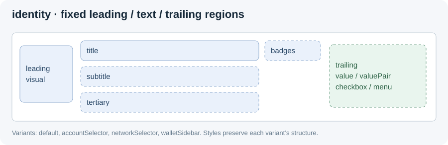

- **Use:** an identifiable asset, account, wallet, network or setting.
- **Required data:** `leading`, `title`; optional `subtitle`, `tertiary`, `badges`,
  `trailing`, `leadingAction`, match ranges and structured subtitle segments.
- **Variants:** default horizontal row; `accountSelector` and `networkSelector`
  preserve selector control geometry; `walletSidebar` uses a compact, centered
  wallet presentation. A variant is explicit model data, never inferred from font size.
  Selector control geometry applies when the row has an explicit height from
  either `style.container.height` or the legacy `row.height`.
- **Separator:** the default native separator inset is 60 for identity rows
  and 12 for other templates (Web 0).
- **Platform default:** without `subtitleLines` or `style.subtitle.lines`, the
  subtitle shows one line on iOS and Web but two on Android (STYLE_SPEC §6.2).
- **Text style roles:** `title`, `subtitle`, `tertiary`, `badge`, `value`,
  `valueSecondary`. The last two refer to value accessories in `trailing`; `badge`
  refers to badge text. `value`/`valueSecondary` select the first/second value
  accessory, ignoring intervening controls. A `valuePair` is one accessory, so
  its style applies to both text runs. They are semantic roles, not extra top-level data fields.
- **Layout boundary:** reserve visual and accessory slots; text compresses within
  its own column. Styling cannot move a checkbox/menu into the title column,
  reorder accessories or convert a horizontal row into the sidebar presentation.
- **Verification:** Web style ordering and removal have DOM regression coverage
  for both selector presentations. Rendered geometry remains to be verified.

## walletGroup

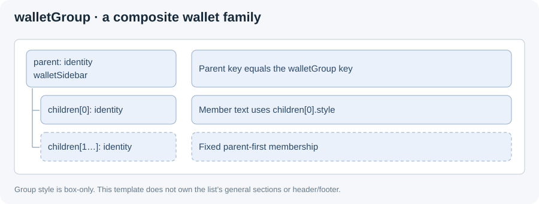

- **Use:** one wallet family in the wallet sidebar, as a single composite row.
- **Required data:** `parent: IdentityRow`, nonempty `children: IdentityRow[]`.
  Every member must use `presentation: 'walletSidebar'`; `parent.key` must equal
  the group row's `key`, and member keys must be unique within the group.
- **Default appearance:** the group border is drawn beneath member content.
  Native groups ignore the row-level `backgroundColor` (legacy): the fill is
  `style.container.backgroundColor` or the theme `subduedBackground`. Legacy Web
  still applies `backgroundColor` inline, so use `style.container.backgroundColor`
  for a cross-platform fill. `style.container` background, border and radius
  override the group fill, border and radius on every platform.
- **Drag:** only `draggable: false` excludes a member from starting the group
  drag; disabled members can start it. The compact allocation is 68 on iOS/Web
  and `max(68, parent height + 2 × vertical inset)` on Android.
- **Style surface:** group `style` exposes the shared container appearance and horizontal/vertical padding. Text styles belong to
  `parent.style` or the individual `children[i].style`; there is no inherited
  group `title`/`value` text style. Measured group height is the sum of member
  heights, 12-unit member gaps and twice the vertical inset. The default inset
  is 1 unit (the group border) when the parent member carries `height`, else 0;
  `style.verticalPadding` / `horizontalPadding` replace it rather than adding
  to it, and bind uses the same value as measurement on every platform.
  iOS/Android ignore the group's own `row.height` (legacy; `style.container.height`
  still wins); Web honors it.
- **Member lifecycle:** each member uses an independent Identity renderer, reused
  by member key. Removed members release their images/actions immediately.
  Press and accessory events use the member key; group dragging remains atomic.
  Optional trailing controls require sufficient caller-supplied member height.
- **Layout boundary:** preserve parent-first member order and wallet member
  structure. Local padding cannot change ownership, member count or drag identity.
  Group `lineGap` does not override the text spacing inside member rows.
- **Common-capability boundary:** this is not a generic section and does not
  control header/footer placement. General grouped cards use `groupId` and
  `groupPosition`; do not conflate those with this composite template.

## rail

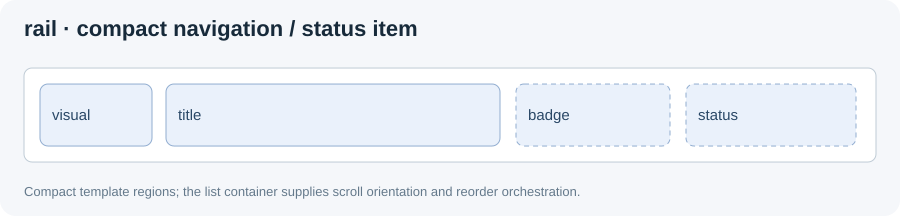

- **Use:** a compact navigation or status item, including horizontal rails.
- **Required data:** `visual`, `title`; optional `badge`, `status` and `draggable`.
  Status is one of `none`, `online`, `warning`, `error`.
- **Text style roles:** `title`, `badge`, `status` where rendered. Status can be a
  platform-specific indicator rather than a text label; accepting a text style
  does not prove that path has a visible effect.
- **Layout boundary:** retain the compact visual/title/accessory structure.
  Row styling cannot enable horizontal scrolling or reorder for the whole list;
  orientation and reorder orchestration belong to the container.
- **Current divergence:** default height is 40 on iOS/Web and 28 on Android.
  This catalog does not change those defaults.

## activity

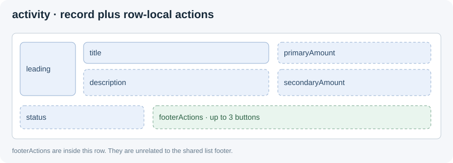

- **Use:** a transaction/activity record with amounts and optional commands.
- **Required data:** `leading`, `title`; optional `secondaryLeading`,
  `description`, `status`, `primaryAmount`, `secondaryAmount`, `footerActions`.
  At most three footer actions are accepted, each with a unique key.
- **Text style roles:** `title`, `description`, `status`, `primaryAmount`,
  `secondaryAmount`. `footerActions` do not gain a freeform style surface.
- **Layout boundary:** amounts remain in the amount column, description stays
  in its text region, actions stay in the row's action area. Adding actions is a
  model/height choice, not a typography trick.
- **Common-capability boundary:** `footerActions` are inside this activity row.
  The list footer is independently configured through the container.

## message

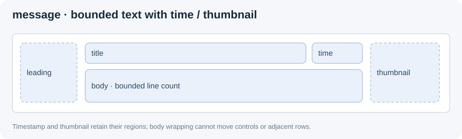

- **Use:** a notification or message preview.
- **Required data:** `title`, `body`, `time`; optional `leading`, `thumbnail`,
  `unread`. `bodyLines` is the legacy fallback for one, two or three body lines.
- **Text style roles:** `title`, `body`, `time`. `style.body.lines` accepts one, two or three and takes precedence over `bodyLines`.
- **Layout boundary:** time and thumbnail keep their allocated regions; body
  text wraps/truncates within the message area. Styling cannot displace the
  timestamp, grow over the next row, or turn the preview into unbounded content.
- **Current divergence:** leading-image size and body typography differ across
  platforms. Larger line boxes need explicit height and visual verification.

## dataRow

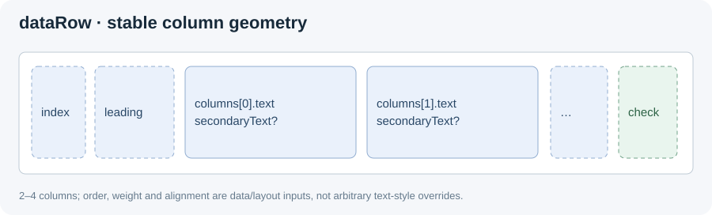

- **Use:** compare values in a linear list or table.
- **Required data:** `columns` with two to four entries. Each column has `key`,
  `text`, optional secondary text, `weight` (1/2/3), alignment and tones.
  Optional row fields include `leading`, `index`, badges, checkbox and favorite state.
- **Text style roles:** `columns` styles primary column text; `columnSecondary`
  styles secondary column text; `index` styles the ordinal. These are collective
  semantic roles, not arbitrary per-native-label selectors.
- **Layout boundary:** column order/count/weights are data, shared table column
  alignment is layout. Text styles cannot change those or move favorite/checkbox
  controls into a data column. Default heights (legacy, per platform): linear
  56, or 60 with secondary text (Android 64); table 60 with secondary text,
  otherwise 48 on iOS/Web and 52 on Android (STYLE_SPEC §6.1).
- **Linear layout per platform (legacy defaults):**
  - *iOS and Android, unstyled:* one label per column holding the primary text,
    up to two inline badge runs and the secondary text on a second line.
    `secondaryLeadingText` is not rendered. On Android, `disabled`/`caution`
    tones render as primary text (legacy tone mapping).
  - *iOS, styled:* the same single label. `columns`/`columnSecondary` apply
    font, weight, color, line height and alignment to their text runs/lines;
    `lines`, `truncate`, `verticalAlignment` and `offsetY` act on the whole
    label. Badge pills keep the legacy two-space padding inside their
    background; `titleBadgeGap` adds an exact, unfilled gap between the title
    and the first pill. Unstyled rows are unchanged.
  - *Android, text-styled:* only `style.columns`, `columnSecondary`, `lineGap`
    or `titleBadgeGap` switch a row off the legacy layout (single label per
    column in linear; fixed 40dp column blocks with 20/16dp lines in table).
    The separate column view is then used (primary line with pill badges,
    secondary line with secondary leading text), so each role styles its own
    view. Container, padding, image, `leadingGap` and `index` styles keep the
    legacy text layout.
  - *Web:* `secondaryLeadingText` precedes the primary text on the same line,
    badges follow it, and secondary text is directly below.
  - Table layout uses the column view on every platform (Android unstyled:
    the fixed legacy column geometry above).
- **Style isolation:** primary and secondary text use independent style targets in
  linear and table layouts on all three platforms. Column badges keep their own typography.

## market

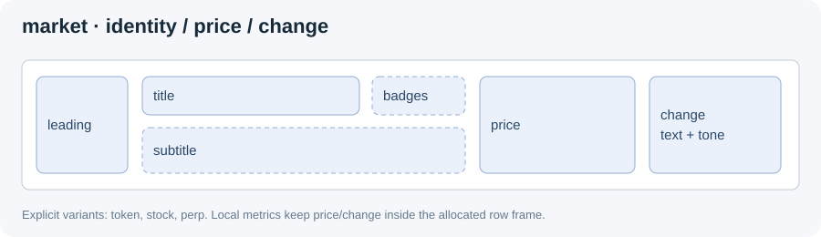

- **Use:** a recycled market quote row with already formatted/localized values.
- **Required data:** `variant: token | stock | perp`, `leading`, `title`, `price`,
  `change` (text and tone). Optional subtitle segments/prefix, badges, leading
  action and press/press-in/long-press action keys remain data.
- **Text style roles:** `title`, `subtitle`, `price`, `change`.
- **Additional local parameters:** `titleBadgeLayout: 'inline'`,
  `contentTrailingGap`, `subtitleTrailingPadding`, `changeWidth`, `changeHeight`,
  `changeCornerRadius`, plus box/image metrics. Badge models and subtitle prefix
  have their own existing style fields; they do not create arbitrary child views.
- **Layout boundary:** price and change keep their regions; the localized name
  compresses independently from volume where supported. Styling does not change
  token/stock/perp structure or affect sections, index navigation or pagination.

## mediaTile

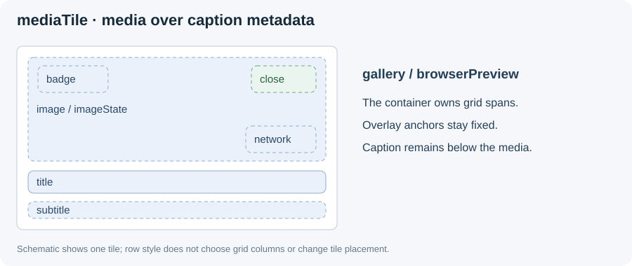

- **Use:** a gallery tile or browser preview.
- **Required data:** `variant: gallery | browserPreview`, `title`. Optional
  image/image-state, subtitle, badge, network image and close-action key.
- **Text style roles:** `title`, `subtitle`, `badge`.
- **Layout boundary:** media stays above caption metadata; network/close/badge
  overlays keep their template anchors. A text style cannot change the grid
  column count, tile span or move the caption over the image.
- **Common-capability boundary:** grid columns and list scrolling belong to
  `snapshot.layout`, not to `MediaTileRowStyle`. Primary-image overrides are
  supported on all three platforms; network/close overlays retain their anchors.

## metricCard

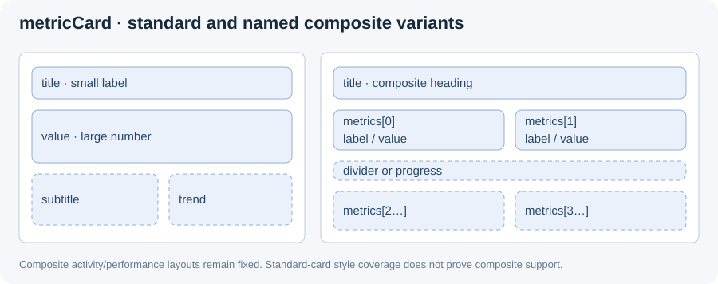

- **Use:** a single KPI or a fixed portfolio activity/performance summary.
- **Required data:** `title`, `value`; optional subtitle, trend/tone, visual, badge,
  metrics and progress. The model still requires `value` for composite variants.
- **Variants:** default/`standard` shows a large value; `activity` and `performance`
  use the fixed composite arrangement. `metrics`, when supplied, contains two to
  five entries; each entry has key, label and value. Progress is bounded to 0…1.
- **Text style roles:** `title` is the small label on the standard card; `value`
  is the large number; `subtitle` and `trend` have their own roles. Do not map them
  by shared UIKit/Android view names, which are different from these meanings.
  In `activity`/`performance`, only `title` maps to the composite heading. The
  other standard-card roles do not address `metrics[].label` or `metrics[].value`.
- **Layout boundary:** styles cannot change the number/order of metric cells or
  turn the standard card into a composite card. Composite subfield mapping needs
  explicit coverage; do not assume `style.value` reaches every nested metric.
- **Style boundary:** nested metric fields have no declared local text-style roles on any platform.
  The standard card example alone cannot validate composite heading styling.

## sectionHeader

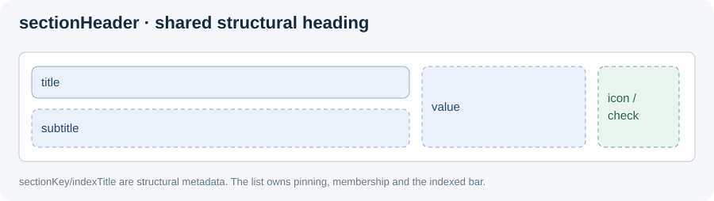

- **Use:** a structural section heading or list summary, independent of the
  business templates in the section.
- **Required data:** `sectionKey`, `title`; optional subtitle, value, title/value
  icons/actions, checkbox, `sticky`, `indexTitle`. Variants: default, `summary`,
  `gallery`, `history`; `presentation: 'networkSelector'` is also available.
- **Text style roles:** `title`, `subtitle`, `value`.
- **Layout boundary:** preserve heading/value/control regions. `summary` does
  not accept a checkbox and is not sticky. Pinning and index-entry generation are
  container behavior, not a text-style property.
- **Common-capability boundary:** `sectionHeader` is the current serialized
  heading descriptor, not a header feature attached to `identity` or another
  content template. `indexTitle` supplies the shared indexed bar's label.
- **Pinned rendering:** the container reuses the ordinary header renderer on all
  platforms, including headers with a value or checkbox. Summary is non-sticky.

## action

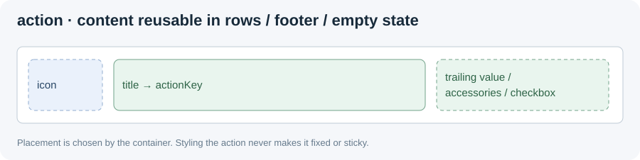

- **Use:** a row-level command, including content used in a fixed footer.
- **Required data:** `title`, `actionKey`; optional tone (`primary`, `neutral`,
  `danger`), icon, checkbox and trailing accessories. `accountSelector` is a
  named presentation variant.
- **Text style roles:** `title`, `value` (a trailing value accessory).
- **Layout boundary:** preserve icon/text/control ordering and action hit areas.
  Styling cannot create a new command or change action routing.
- **Common-capability boundary:** the same action descriptor can live in
  `rows`, `fixedFooter` or `emptyState`. The container decides placement and
  visibility; the action template only renders its content.

## system

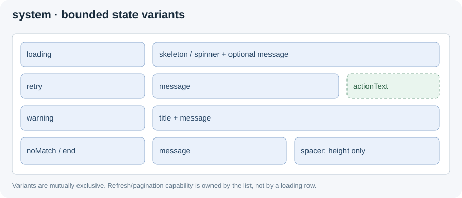

- **Use:** bounded status content rather than a business record.
- **Variants and required data:** `loading` has optional message and
  skeleton/spinner choice; `retry` requires message/action key with optional
  action text; `warning` requires title/message; `noMatch` requires message;
  `end` has optional message; `spacer` requires explicit height.
- **Text style roles:** `title` for a visible title, `message` for status copy,
  `actionText` for the native retry button text. Web (legacy) draws no retry
  button for any presentation: a Web retry row is message-only and the row
  press (click, Enter or Space) emits `actionKey`, so `actionText` and
  `style.actionText` have no Web target (native only). On Android the Market
  retry/noMatch message and the retry `actionText` ellipsize at the end by
  default; an explicit `lines` or `truncate` (including `clip`) wins. A spacer has no text slot; skeleton/spinner styling
  does not become arbitrary drawing through these text roles.
- **Layout boundary:** keep each variant's indicator/text/action structure and
  bounded height. Styling cannot convert loading into retry, turn a spacer into
  content, or hide adjacent rows.
- **Common-capability boundary:** a system row can be regular content,
  `emptyState` or `fixedFooter`. Refresh/pagination state remains on the list;
  a loading row alone does not enable either capability.

## Composition example: shared sections, footer and indexed bar

This uses existing public fields. Both content templates share one section;
neither implements its own header, footer, scrolling or indexed bar. There is no
new header prop in this example: the heading is a structural row.

```ts
import type { NativeListSnapshot } from '@onekeyfe/react-native-native-list';

const snapshot: NativeListSnapshot = {
  schemaVersion: 1,
  generation: 1,
  layout: { kind: 'sectioned', stickyHeaders: true },
  capabilities: { sectionIndex: { enabled: true } },
  rows: [
    {
      type: 'sectionHeader', key: 'section-a', sectionKey: 'a',
      title: 'Assets', indexTitle: 'A',
    },
    {
      type: 'identity', key: 'asset-btc', sectionKey: 'a',
      leading: { kind: 'icon', name: 'StarOutline' }, title: 'Bitcoin',
      style: { title: { token: '$bodyMd' } },
    },
    {
      type: 'market', key: 'quote-eth', sectionKey: 'a', variant: 'token',
      leading: { kind: 'token', fallbackText: 'ETH' }, title: 'Ethereum',
      price: '$2,400', change: { text: '+2.4%', tone: 'positive' },
    },
  ],
  fixedFooter: {
    type: 'action', key: 'continue', title: 'Continue', actionKey: 'continue',
  },
};
```

`listRef.current?.scrollToKey({ key: 'quote-eth', animated: true })` addresses the
stable row key through the shared list API. Changing the quote's content template
while preserving a valid key/section does not introduce a new scroll API.

For completion criteria and the source audit, return to
[STYLE_SPEC §6–§9](STYLE_SPEC.md#65-consolidated-gap-audit).
