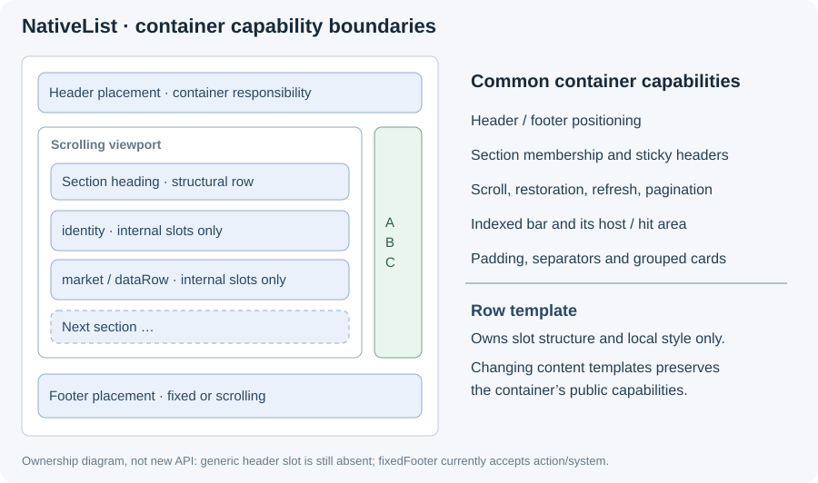

# NativeList Style Spec

Status: **shared style contract implemented in source; native rendered acceptance pending**. Consolidated on 2026-09-22
from PRs #107, #109, #110, #111 and #112, on main `feac35eb6`.
Use symbol names as source anchors. Tables of legacy defaults below are an
inventory, not evidence of three-platform visual acceptance.

This document is the shared design vocabulary for `@onekeyfe/react-native-native-list`.
iOS, Android, and Web each own a separate renderer, and nothing in the build forces
them to agree. This spec is therefore **authoritative by review, not by codegen**.
It records what a value is called, what it should be, and what each platform
currently does — so a divergence is visible in review instead of on a device.

See [DESIGN.md](DESIGN.md) for the architecture and ownership model.
Start with the [illustrated template catalog](ROW_TEMPLATES.md) for each template's
purpose, fields, variants, fixed structure and allowed local styling.

## 1. Why this exists

The current `RowModel` union declares **12** row types, including `walletGroup`
and the structural `sectionHeader`. Presentation variants are not additional row
types. Every
template hard-codes its own typography and geometry in three places, and the three
vocabularies have drifted:

- The package's theme keys and the application's design tokens are **two different
  names for the same colors**. Every consumer writes a mapping table by hand.
- The application has a named type scale (`$bodyMd`, `$headingSm`, …). The list has
  ten-plus bare font sizes and references the scale nowhere. "One step smaller" has
  no shared meaning.
- The same concept resolves to different numbers per platform (see §6).

This branch extends the original Market style API to the other row types. A
template defines structure; a local style parameter customizes a named part of
that structure. Header/footer placement, sections, scrolling and the indexed bar
belong to the list container, independently of the content template.

### 1.1 Ownership contract

| Owner | Responsibility | Must not control |
| --- | --- | --- |
| List container | Viewport, header/footer placement, sections, scroll position, refresh/load more, indexed bar and list chrome | The business meaning of a content row |
| Layout | Orientation, row allocation, grid spans/table columns, content padding and item spacing | Typography of a particular row field |
| Row template + variant | Slot order, hierarchy, required/optional fields, compression and bounded line counts | Whether the list has a header, footer, section index or scroll API |
| `row.style` | Allowlisted typography, colors and bounded local metrics | Arbitrary children, flex direction, positioning, reparenting or list-level geometry |

**Normative requirement:** replacing an `identity` row with a `market` or
`dataRow` in the same valid container must not remove that container's common
capabilities. Compatibility conditions may depend on layout/orientation (for
example the indexed bar requires vertical sections), not a particular business
row template. This requirement does not claim every current renderer satisfies it.
Current API limits and implementation gaps are explicit in §5 and §6.5.

### 1.2 Row template and row style are different contracts

- **Row template** (`row.type` plus its declared `variant`/`presentation`) defines
  the content model and structure: slot order, hierarchy, optional parts, and
  interactions. `identity`, `market` and `dataRow` are templates. Changing a
  template is a model change, not a style change.
- **Row style** (`row.style`) customizes existing semantic fields and local
  metrics within that template. For example, `identity.style.title.fontSize`
  changes title typography; `image.width` changes the primary visual slot.
  A style cannot add a field, reorder slots or change a column's weight.
- **List capabilities** belong to the container. Header/footer placement,
  sections, scrolling, indexed bar, selection and list chrome do not belong to
  either a content template or its row style.

The configurable property names, valid values, semantic targets and precedence
are the same on Web, iOS and Android. A template exposes only parameters for parts
it owns. Unsupported keys are rejected by the shared validator before
serialization; optional or variant-specific parts that are absent are not created
by styling them. See the complete applicability matrix in §4.1.

The 12 templates each have a definition and schematic in ROW_TEMPLATES.md.
Overflow fitting remains the integrating developer's responsibility: choose
fitting text/image/padding values and row heights. Automatic measurement,
combination-fit rejection and style-driven auto-height are outside this contract.
The five source PRs are closed; implementation continues in the consolidated PR.

## 2. How this spec is enforced

The three renderers cannot constrain each other, but they all read the same
`snapshotJson`. That boundary is the single enforcement point.

| Layer | Enforced by | Covers |
| --- | --- | --- |
| Token names and values | `src/validation.ts` resolves tokens to numbers before serialization | §3 |
| Which keys a template accepts | `validateSnapshot` rejects keys not declared for that row type | §4 |
| Numeric bounds | `validateSnapshot` throws on out-of-range values | §3, §4 |
| Per-platform default values | **This document + PR review** | §4, §5 |
| Known divergences | **This document + PR review** | §6 |

A style token is resolved on the JavaScript side. `{ token: '$bodyLg' }` becomes
`{ fontSize: 16, lineHeight: 24, fontWeight: 'regular' }` before it crosses the
bridge — and an explicit `fontSize` alongside the token wins. Native renderers
never learn the token vocabulary and therefore cannot drift from it. Raw numeric
overrides stay available for pixel-parity work. Resolution is idempotent, and a
snapshot with nothing to resolve is returned unchanged, so the common path keeps
object identity.

### Status

| Layer | State |
| --- | --- |
| Per-template key validation, token resolution, patch support | Shared TypeScript/runtime contract; identical for all three renderers |
| Text roles and local box/image parameters | Implemented for the applicable template slots in §4.1; absent optional slots remain absent |
| `dataRow` column styles | Independent primary/secondary text on all platforms, in linear and table layouts |
| Sticky header styles | Android uses the same row view/binder as normal headers; iOS and Web also reuse their row renderers |
| `listStyle.separator` / `groupCornerRadius` | Initial/update propagation and actual-group scope aligned |
| Row heights and overflow | Caller owns row allocation and fitting; style does not introduce auto-height |
| Legacy baseline dimensions | Inventory in §4/§6; explicit style values use logical units independently of Android's legacy list scale |
| Rendered acceptance | The source contract and build checks do not establish full native interaction/pixel acceptance (§9) |

The field-to-view mapping exists twice, once per native language — `nativeListStyleSlot`
in `NativeListModels.kt` and `styleSlot` in `NativeListCell.swift`. §4 is the source of
truth for both; the Kotlin copy is unit-tested, including a check that no template maps
two style keys onto one view.

The example application's **Native List Row Style** page has plain/styled pairs
for all 12 types, plus list chrome and an explicit-height example. Its wallet
group styles the parent member while leaving a child unstyled to expose leakage.
Variant and rendered acceptance coverage is still pending (§9). The catalog
illustrations are structural diagrams, not screenshots or proof of rendering parity.

## 3. T1 — Design tokens

### 3.1 Color tokens

This table maps application token names to `NativeListTheme` keys by meaning.
It does not add runtime aliases: consumers still pass the actual theme keys and
resolved colors; `style.color` does not resolve application color-token names.

| Application token | `NativeListTheme` key | Role |
| --- | --- | --- |
| `text` | `primaryText` | Primary label |
| `textSubdued` | `secondaryText` | Secondary label |
| `textDisabled` | `disabledText` | Disabled / timestamp |
| `textInverse` | `inverseText` | Text on inverted ground |
| `textSuccess` | `positive` | Positive amount |
| `textCritical` | `negative` | Negative amount |
| `textCaution` | `caution` | Warning text |
| `textInfo` | `info` | Informational text, search highlight |
| `bgApp` | `background` | List ground |
| `bg` | `rowBackground` | Row ground |
| `bgActive` | `rowSelectedBackground`, `rowPressedBackground` | Selected / pressed row |
| `bgSubdued` | `subduedBackground` | Card and group ground |
| `bgStrong` | `strongBackground` | Chip / badge ground |
| `bgInverse` | `inverseBackground` | Inverted ground |
| `bgCriticalSubdued` | `criticalBackground` | Failed-state chip |
| `bgCautionSubdued` | `cautionBackground` | Caution chip |
| `borderSubdued` | `separator` | Separator, group border |
| `icon` | `icon` | Icon default |
| `iconSubdued` | `iconSubdued` | Secondary icon |
| `iconActive` | `accent` | Accent — **name mismatch, see §6** |

### 3.2 Typography scale

Sizes below are the application's scale. The "used by" column records which list
slots already sit on that step; slots that do not are listed in §4.

| Token | Size / line height | Weight | Used by |
| --- | --- | --- | --- |
| `$headingXl` | 24 / 32 | semibold | `metricCard.value` (size `large`) |
| `$headingLg` | 20 / 28 | semibold | — |
| `$headingMd` | 18 / 24 | semibold | `sectionHeader` gallery, `metricCard.value` |
| `$headingSm` | 16 / 24 | medium | `identity.title`, `market.title`, `market.price` |
| `$headingXs` | 14 / 20 | semibold | `message.title`, `sectionHeader` default |
| `$bodyLg` | 16 / 24 | regular | `action.title`, `sectionHeader` summary |
| `$bodyMd` | 14 / 20 | regular | `identity.subtitle`, `message.body`, `market.change` |
| `$bodySm` | 12 / 16 | regular | `rail.title`, `market.subtitle`, `identity.badge` |
| `$bodyXs` | 11 / 16 | regular | `metricCard` labels, `market` badges |

Weight names map to the bundled Roobert faces: `regular`, `medium`, `semibold`,
`bold`. No other family is available; `fontFamily` is not part of the style surface.

### 3.3 Spacing, radius, bounds

| Kind | Allowed values | Bound |
| --- | --- | --- |
| Padding / gap | finite number | `0…64` |
| `lineGap` (title to subtitle) | finite number | `0…16` |
| Font size | finite number | `8…48` |
| Line height | finite number | `8…64` |
| Corner radius | finite number | `0…80` |
| Image edge | finite number | `1…160` |

These are the validator's numeric bounds, not a guarantee that every combination
fits a row. Fractional values are accepted; native rounding can differ. See §7.1
for the stronger layout-safety contract and its current enforcement limits.

Radius steps in use: `4` (chip), `8` (rail, small visual), `10` (visual `rounded`),
`12` (row, card), `16` (media tile), `20` (wallet sidebar row on iOS only — §6).

## 4. T2 — Template style surface

`style.X` modifies the rendering of the **model field named `X`**, regardless of
which physical view carries it. This matters because the view pool is shared: on
every platform `metricCard` renders its *value* through the title label and its
*title* through the subtitle label, and the status label carries `rail.status`,
`activity.status`, `message.time`, and `metricCard.trend`. Naming style keys after
views would therefore mis-target. `market` already follows this rule with
`style.price` / `style.change`.

On Web the element rendering a field carries `data-nl-slot="<field>"`, so the
style pass resolves a slot by name rather than by CSS class — on its own,
`.ok-native-list-secondary` is the identity subtitle, the rail status, a metric
label, a data column's secondary text, and a system message. iOS and Android express
the same semantic mapping in native code. Singular style roles such as `badge`
and `value` can refer to repeated badges or values in `trailing`; their precise
meaning is defined in the [catalog](ROW_TEMPLATES.md).

### 4.1 Shared configurable properties

Every text role listed below accepts the same `NativeListTextStyle`:
`token`, `fontSize`, `fontWeight`, `color`, `lineHeight`, `lines`, `alignment`.
Weights are `regular | medium | semibold | bold`; line counts are `1 | 2`;
`start | center | end` alignment follows layout direction. Colors must be
`#RRGGBB` or `#RRGGBBAA`, the common native/Web color format. Omitted properties
preserve the template's values. Explicit properties override token values,
presentation defaults and rich-text runs only for that property.

Every supported image role accepts `width`, `height`, `shape`, `cornerRadius`,
`contentFit`. Shape is `circle | rounded | square`; explicit corner radius wins.
Fit is `cover | contain | fill | center`. These parameters target the primary
visual, not network badges, corner decorations, message thumbnails or nested
metric images. A media tile keeps its square default when only width is set;
an explicit height overrides that aspect. Width/height do not change the outer row allocation.

In the matrix, **padding** means both `horizontalPadding` and `verticalPadding`.
Each cell describes the same public contract on **Web + iOS + Android**.

| Template | Semantic text roles | Local box/image properties |
| --- | --- | --- |
| `identity` | title, subtitle, tertiary, badge, value, valueSecondary | padding, leadingGap, lineGap, titleBadgeGap, trailingGap, image |
| `walletGroup` | None; members own their identity styles | padding |
| `rail` | title, badge, status | padding, leadingGap, titleBadgeGap, trailingGap, image |
| `activity` | title, description, status, primaryAmount, secondaryAmount | padding, leadingGap, lineGap, trailingGap, image |
| `message` | title, body, time | padding, leadingGap, lineGap, image |
| `dataRow` | columns, columnSecondary, index | padding, leadingGap, lineGap, titleBadgeGap, image |
| `market` | title, subtitle, price, change | padding, leadingGap, lineGap, titleBadgeGap, trailingGap, image; Market-specific properties below |
| `mediaTile` | title, subtitle, badge | padding, leadingGap, lineGap, image |
| `metricCard` | title, value, subtitle, trend | padding, leadingGap, lineGap, image |
| `sectionHeader` | title, subtitle, value | padding, lineGap, trailingGap |
| `action` | title, value | padding, leadingGap, trailingGap, image |
| `system` | title, message, actionText | padding, lineGap |

Market additionally exposes `titleBadgeLayout: inline`, `contentTrailingGap`,
`subtitleTrailingPadding`, `changeWidth`, `changeHeight`, `changeCornerRadius`, preserving
its existing template-specific style surface on every platform.

Gap meanings are structural: `leadingGap` separates the primary visual from
content; `lineGap` separates content text rows (primary/secondary per data column);
`titleBadgeGap` separates a title and its badges (vertical for walletSidebar);
`trailingGap` separates trailing values/controls (title/badge to status for rail).
`walletGroup` padding applies only to the group; it never cascades into members.
Composite metric-card `lineGap` separates heading/metric blocks and dividers; it
does not change the typography or inner label/value gap of each metric.

Variant applicability is also shared: composite metric-card `title` styles its
heading, while standard-card `value`/`subtitle`/`trend` do not style nested metrics;
`system.title` applies to warning, `actionText` to retry. A missing leading visual,
badge, subtitle or trailing value remains absent. New nested-metric/thumbnail
style roles require a separately declared cross-platform contract.

All numeric overrides use logical units (CSS px / iOS pt / Android dp), including
explicit typography. Legacy Android scaling may affect omitted defaults, but must
not rescale an explicit style value. Physical-pixel/font-rasterization differences
remain platform-specific. See §3.3 for bounds and §7 for fitting responsibility.

### 4.2 Existing defaults (inventory, not a pixel parity claim)

Legend: **=** inventoried defaults agree; **≠** legacy divergence, see §6.

### identity

| Key | Default | iOS | Android | Web |
| --- | --- | --- | --- | --- |
| `title` | `$headingSm` | 16 medium / 24 | sp(16) medium / dp(24) | 16px / 20px / 600 **≠** |
| `subtitle` | `$bodyMd` | 14 regular / 20 | sp(14) regular / dp(20) | 14px / 20px **=** |
| `tertiary` | `$bodyMd` | 14 regular / 20 | sp(14) / dp(20) | 14px / 20px **=** |
| `badge` | `$bodySm` | 12 medium / 16, pad 8/2, r4 | sp(12) / dp(16), pad 8/2, r4 | 11px / 18px, pad 0 5, r5 **≠** |
| `value` | `$headingSm` | 16 medium | sp(16) medium / dp(24) | 14px / 20px / 500 **≠** |
| `valueSecondary` | `$bodyMd` | 14 regular | sp(14) regular / dp(20) | 14px **=** |
| box | pad 12/8, gap 12 | 12 / -12 / 8 / -8, spacing 12 | dp(12), dp(8) | `padding:8px 12px`, `gap:12px` **=** |
| `image` | 40 | 40×40 (32 for `network`) | 40 (32 for `network`) | 40px (32px for account) **=** |

### identity · presentation `walletSidebar`

| Key | Default | iOS | Android | Web |
| --- | --- | --- | --- | --- |
| `title` | `$bodySm` | 12 regular / 16, centered | sp(12) / dp(16), centered | 12px / 16px / 400 **=** |
| `badge` | `$bodyXs` | 11 / 14, pad 6/2, r4 | sp(11) / dp(14), pad 6/2, r4 | 11px / 14px, pad 2 6, r4 **=** |
| `image` | 40 | 40×40, fallback 28 | 40, fallback sp(28) | 40px **=** |
| box | pad 4 | 4 / -4 / 4 / -4 | dp(4) × 4 | `padding:4px 8px` **≠** |
| row radius | 12 | 20 | 12 | 12 **≠** |

### identity · presentation `accountSelector`

| Key | Default | iOS | Android | Web |
| --- | --- | --- | --- | --- |
| `title` | `$bodyLg` | 16 regular | sp(16) regular | 16px / 20px / 400 **=** |
| `subtitle` | `$bodyMd` | 14 regular / 20 | sp(14) / dp(20) | 14px / 20px / 400 **=** |
| `image` | 32 | 32×32 | 32 | 32px **=** |
| trailing icon | 38 | 38, margin −7 | dp(38), margin −dp(7) | 38px, margin −7px **=** |

### identity · presentation `networkSelector`

| Key | Default | iOS | Android | Web |
| --- | --- | --- | --- | --- |
| `title` | `$headingSm` | 16 medium / 24 | sp(16) / dp(24) | 16px / 24px / 500 **=** |
| `image` | 32 | 32×32, fallback 19/27 semibold | 32, fallback sp(19)/dp(27) | 32px, fallback 19/27/600 **=** |
| checkbox | 20, r4, border 2 | 20×20, r4, border 2 | dp(20), r4f, stroke dp(2) | 20px, r4, border 2px **=** |

### walletGroup

| Key | Default | iOS | Android | Web |
| --- | --- | --- | --- | --- |
| member gap | 12 | stack spacing 12 | topMargin dp(12) | `gap:12px` **=** |
| container radius | 12 | 20 | dp(12) | 12px **≠** |
| container border | 1, `borderSubdued` | 1 | dp(1) | 1px **=** |

### rail

| Key | Default | iOS | Android | Web |
| --- | --- | --- | --- | --- |
| `title` | `$bodySm` | 12 medium / 16 | sp(12) / dp(16) | 12px / 500 **=** |
| `badge` | `$bodySm` | 12 medium / 16 | sp(12) medium / dp(16) | — |
| `status` | `$bodySm` | 12 regular / 16 | sp(12) | — |
| box | pad 4, gap 6 | 4 / -4, spacing 6 | dp(4), spacing 6 | `padding:4px;gap:6px` **=** |
| `image` | 20 | 20×20 | 20 | 20px **=** |
| row radius | 8 | 8 | 8 | 8px **=** |

### activity

| Key | Default | iOS | Android | Web |
| --- | --- | --- | --- | --- |
| `title` | `$headingSm` | lineHeight 24 | dp(24) | 16px / 20px **≠** |
| `description` | `$bodyMd` | lineHeight 20, 2 lines | dp(20), 2 lines | 14px / 20px **=** |
| `primaryAmount` | `$headingSm` | 16 medium / 24, tabular | sp(16) medium / dp(24) | 16px / 20px **≠** |
| `secondaryAmount` | `$bodyMd` | 14 regular / 20, tabular | sp(14) / dp(20) | 14px **=** |
| footer action | `$bodyMd` | 12 medium, r8, pad 4/8 | sp(14) semibold, r8f, pad 8/4 | 12px / 16px / 600 **≠** |

### message

| Key | Default | iOS | Android | Web |
| --- | --- | --- | --- | --- |
| `title` | `$headingXs` | 14 semibold / 20, 2 lines | sp(14) semibold / dp(20) | 15px / 20px / 600 **≠** |
| `body` | `$bodyMd` | 14 regular / 20 | sp(14) / dp(20) | 13px / 18px **≠** |
| `time` | `$bodySm` | 12 / 16, `textDisabled` | sp(12) / dp(16), `disabledText` | 11px / 16px **≠** |
| `image` | 28 | 28×28 | 28 | 40px **≠** |
| thumbnail | 64, r6 | 64×64, r6 | dp(64), r6f | 64px, r10 **≠** |
| box | pad 12/16 | 16 / -16 | dp(12), dp(16) | `padding:8px 12px` **≠** |

### dataRow

| Key | Default | iOS | Android | Web |
| --- | --- | --- | --- | --- |
| `columns` (linear) | `$bodyMd` | 14 medium / 20 | sp(16) medium / dp(20) | 16px / 500 **≠** |
| `columns` (table) | `$bodyMd` | 14 medium / 20 | sp(14) medium / dp(20) | 16px / 500 **≠** |
| column secondary | `$bodySm` | 12 regular / 16 | sp(12) / dp(16) | — |
| `index` | `$bodySm` | — | dp(32) slot | 13px, 28px slot **≠** |
| favorite icon | 20 | 20×20 | dp(20) | 24px / 22px glyph **≠** |
| box | pad 12/6 | table 20/10 | table dp(20)/dp(10) | `padding:6px 12px` **=** |

### market

Already fully data-driven through `MarketRowStyle`. The values below are the
defaults applied when `style` is absent.

| Key | Default | All platforms |
| --- | --- | --- |
| `title` | `$headingSm` | 16 / 24 / medium |
| `subtitle` | `$bodyMd` | 14 / 20 / regular |
| `price` | `$headingSm` | 16 / 24 / medium |
| `change` | `$bodyMd` | 14 / 20 / medium, block 80×32 r8 |
| box | pad 20/12, gap 14 | perp 16, gap 8 |
| `image` | 32 (stock 40) | circle |

### mediaTile

| Key | Default | iOS | Android | Web |
| --- | --- | --- | --- | --- |
| `title` | `$headingSm` | 16 medium / 24 | sp(16) / dp(24) | 16px / 500 **=** |
| `subtitle` | `$bodySm` | 12 regular / 16 | sp(12) / dp(16) | 12px **=** |
| `badge` | `$bodyMd` | 14 medium, h24, r10 | sp(14), h dp(24), r10f | — |
| image radius | 10 | 10 | dp(10) | 10px **=** |
| tile radius | 16 | 16 | 16 | 16px **=** |
| network badge | 14 | 14×14, r7 | dp(14), circle | 14px, r50% **=** |

### metricCard

`title` is the small label; `value` is the large number. They are rendered through
the subtitle and title views respectively — do not follow the view names.

| Key | Default | iOS | Android | Web |
| --- | --- | --- | --- | --- |
| `title` | `$bodyXs` | 11 regular, `textDisabled` | sp(11), `disabledText` | 14px **≠** |
| `value` | `$headingMd` | 18 semibold (24 when `size: large`) | sp(18) / sp(24) semibold | 22px / 28px / 700 **≠** |
| `trend` | `$bodySm` | 12, tone colored | sp(12), tone colored | — |
| metric label | `$bodyXs` | 11 regular / 14 | sp(11) / dp(14) | — |
| metric value | `$bodyMd` | 14 medium / 20 | sp(14) medium / dp(20) | 18px / 600 **≠** |
| card padding | 14 | 14 | dp(14) | 12px **≠** |
| card radius | 12 | 12 | 12 | 12px **=** |
| progress bar | 4, r2 | 4, r2 | dp(4), r dp(2) | 4px, r2 **=** |

### sectionHeader

| Variant | Default | iOS | Android | Web |
| --- | --- | --- | --- | --- |
| default | `$headingXs` | 14 semibold / 20 | sp(14) semibold / dp(20) | 13px / 18px / 700 **≠** |
| `summary` | `$bodyLg` | 16 medium / 24 | sp(16) medium / dp(24) | 16px / 500 **=** |
| `gallery` | `$headingMd` | 18 semibold / 24 | sp(18) semibold / dp(24) | 16px **≠** |
| `history` | `$bodySm` | 12 semibold / 16, tracking 0.8 | sp(12) semibold / dp(16), tracking 0.8 | 12px / 16px **=** |
| table layout | `$bodyXs` | 11 regular / 14 | sp(11) regular / dp(14) | — |
| `value` | `$bodyLg` | 16 / 24 | sp(16) medium / dp(24) | 14px / 20px / 500 **≠** |

### action

| Key | Default | iOS | Android | Web |
| --- | --- | --- | --- | --- |
| `title` | `$bodyLg` | 16 / 24 | sp(16) / dp(24) | 15px / 600 **≠** |
| `title` (accountSelector) | `$bodyLg` | 16 medium / regular | medium / regular | 16px / 24px / 400 **=** |
| icon slot | 40 (32 accountSelector) | 40 / 32, glyph 24 | 40 / 32, glyph dp(24) | 40px / 32px **=** |
| box | pad 16 | — | — | `padding:0 16px` **=** |

### system

| Variant | Default | iOS | Android | Web |
| --- | --- | --- | --- | --- |
| `loading` skeleton | — | marks 32 / 80×16 / 60×12 / 80×18 | same | same **=** |
| `loading` spinner | 20 | 20, market 32 | dp(20), market 32 | 20px, market 32px **=** |
| `retry` | `$bodyMd` | 14 medium / 20, r14 | sp(14) / dp(20), r16f | 12px **≠** |
| `noMatch` / `end` | `$bodyMd` | 14 regular / 20 | sp(14) / dp(20) | 14px **=** |
| `warning` | `$bodyMd` | 14 medium + regular / 20 | sp(14) / dp(20) | 14px / 20px **=** |
| `spacer` | — | `height` only | `height` only | `height` only **=** |

### Carrier coverage

Rows in `snapshot.rows`, `snapshot.fixedFooter`, and `snapshot.emptyState` reuse
the row binders. The two standalone descriptors currently accept only `action`
or `system` in the public TypeScript API. `sectionHeader` is a structural row in
`rows`. Reusing a binder does not transfer ownership of footer positioning,
empty-state placement or header pinning to the row template. Android's pinned
header reuses the ordinary header row view and callbacks (§6.3).

## 5. T3 — List chrome

Chrome is not part of a row. This branch has `snapshot.listStyle` for separator
inset/color and grouped-card radius. Common capabilities remain in their existing
container APIs; being public does not require placing everything in `listStyle`.

### 5.1 Common capabilities and current API

| Capability | Existing entry point | Contract and current limit |
| --- | --- | --- |
| List header | Leading structural/summary rows; `CollapsiblePagerView.header` and `stickyHeader` for composed React content | Header placement belongs to the container. There is currently **no generic public `listHeader`/`ListHeaderComponent` prop**; arbitrary React children inside NativeList are not part of the current template API |
| List footer | A trailing `action`/`system` row scrolls with content; `snapshot.fixedFooter` stays outside the scrolling rows | Available independently of the content row type. `fixedFooter` currently accepts only `ActionRow \| SystemRow`; row style controls its content, not its fixed placement |
| Sections / sticky headers | `layout.kind: 'sectioned'`, `sectionHeader.sectionKey`, member `sectionKey`, `layout.stickyHeaders`, header `sticky` | A section can contain different content templates. `sectionHeader` describes the heading; the container owns membership, positioning and pinning. Complex headers share the normal row renderer when pinned; summary headers remain non-sticky on all three platforms (§6.3) |
| Scroll and restoration | `NativeListRef.scrollToKey/Index/Item/Offset/End/Location`, `initialScrollKey/Index` and view position/offset props | Shared viewport behavior, independent of row template. Style must not silently change measured offsets or invalidate stable row keys |
| Indexed bar | `capabilities.sectionIndex`, `sectionHeader.indexTitle`; Web has `webSectionIndexContainerRef` | Requires vertical `sectioned` layout; entries follow indexed header order and target header keys. No dependency on `identity`, `market`, or another content template |
| Refresh / pagination | `capabilities.pullToRefresh/refreshing/loadMore/endReachedThreshold`, `onRefresh`, `onEndReached`, `setRefreshing` | Container gestures/state; indicator implementation may differ by platform |
| Empty state | `snapshot.emptyState` (`ActionRow \| SystemRow`) | Container decides when to display it, independently of the regular content templates |
| Selection / reorder | `snapshot.selection`, `capabilities.reorderable`, selection/reorder events | Common orchestration; each row's available controls/draggable support still depend on its declared model |
| Separator / grouped cards | `listStyle`, row `separator`, `groupId` and `groupPosition` | Styling scope is the list; group membership is data. A custom group radius must not change unrelated template cards |

The header/footer slots in the diagram are ownership boundaries, not newly
available props. Do not introduce `marketHeader`, `identityFooter`, or per-template
scroll/index configuration. A future public header or broader footer carrier must
extend the container contract once, with the same placement rules for all content.

`activity.footerActions` means buttons **inside one activity row**. It is unrelated
to the list footer. Similarly, `walletGroup` is a composite wallet template, not
the list's general section mechanism.

### 5.2 Chrome surface

| Item | Data-driven today | iOS | Android | Web |
| --- | --- | --- | --- | --- |
| Content padding | yes (`layout.contentPadding*`) | `contentInset` | `setPadding` | `paddingValues` |
| Item spacing | yes (`layout.itemSpacing`) | flow layout spacing | `ItemSpacingDecoration` | layout gap |
| Separator | **yes** — `listStyle.separator.{inset,color}` | 1/scale, inset 60/12 | 1px, inset dp(60)/dp(12) | `1px`, class rule, **no inset** |
| Group card radius | **yes** — `listStyle.groupCornerRadius` | 20 / 12 | dp(12) | 12px |
| Section index rail | partial (`capabilities.sectionIndex`) | static constants, label 10 | `SECTION_INDEX_*_DP`, raw density | `SECTION_INDEX_*` + CSS |
| Section index preview | no | 48×48 r14, 22 semibold | preview w/h/margin constants | 48px r14, 22px |
| Pull to refresh | partial (`capabilities.pullToRefresh`) | `UIRefreshControl` | `SwipeRefreshLayout` | custom pill, 12px |
| Reorder preview | no | — | — | r12, shadow `0 4px 24px` |
| Reorder count badge | no | 24 h, r12, 12 semibold | dp(24), r dp(12), sp(12) semibold | 24px, r12, 12/22/600 |

The section index rail is three separate constant sets for one control; Android's
`sectionIndexDp()` deliberately never follows the source-scale switch.

`listStyle` carries only what all three platforms can honour. The rest of this table
is deliberately excluded rather than declared and half-implemented:

- **Pull to refresh** is a system control on both native platforms (`UIRefreshControl`,
  `SwipeRefreshLayout`); only Web draws its own indicator.
- **Section index rail and preview** belong to `capabilities.sectionIndex`, which is
  where their geometry should go if it is ever exposed, and are three independent
  constant sets today.
- **Reorder preview and count badge** are drawn with platform-specific primitives —
  Android paints the badge on `Canvas` inside `dispatchDraw`, Web uses a CSS overlay,
  and iOS has neither.
- **Content padding and item spacing** are already `layout.contentPadding*` and
  `layout.itemSpacing`; duplicating them here would give one value two homes.

Every `listStyle` value is absent by default, and each platform keeps its own number
as the fallback, so an untouched list renders exactly as before. On Web that required
the inset separator to keep the transparent `border-bottom` for layout and paint the
visible line with a logical-inset overlay, rather than moving the row by a pixel.

## 6. T4 — Known divergences

Registered, **not** fixed by this document. Changing any of these requires a PR
that cites this table and carries device verification.

### 6.1 Row heights

Row height is computed from data by three independent implementations —
`RNCNativeListView.rowHeight()`, `NativeListRowView.applySize()`, and
`estimateWebRowHeight()`. They disagree:

| Template | iOS | Android | Web |
| --- | --- | --- | --- |
| `rail` | 40 | 28 | 40 |
| `activity` + footer actions | 100 | 104 | 100 |
| `dataRow` + secondary text | 60 | 64 | 60 |
| `sectionHeader` `summary` | 68 | 80 | 68 |
| `sectionHeader` value + checkbox | 56 | 40 | 56 |
| `message`, `mediaTile`, composite `metricCard` | computed / 244 / 160+ | 0 (wrap content) | computed / 244 / 161 |

Within iOS, `NativeListCell.bindMessage()` sizes the leading slot at 28 while
`rowHeight()` estimates text width against 40; `bindSystem()` uses 52/120 for a
market retry row where `rowHeight()` uses 44, and 88 for `noMatch` where
`rowHeight()` uses 44.

These values may have been tuned per platform on real devices. They are recorded
here and left alone.

### 6.2 Typography and geometry

| Concept | iOS | Android | Web |
| --- | --- | --- | --- |
| `identity.title` | 16 medium / 24 | sp(16) medium / dp(24) | 16px / **20px** / **600** |
| `identity.badge` | 12 / 16, pad 8/2, r4 | sp(12) / dp(16), pad 8/2, r4 | **11 / 18, pad 0 5, r5** |
| `message.body` | 14 / 20 | sp(14) / dp(20) | **13 / 18** |
| `message` leading | 28 | 28 | **40** |
| `sectionHeader` default | 14 semibold / 20 | sp(14) semibold / dp(20) | **13 / 18 / 700** |
| `action.title` | 16 / 24 | sp(16) / dp(24) | **15 / 600** |
| `metricCard.value` | 18 semibold | sp(18) semibold | **22 / 28 / 700** |
| visual `rounded` radius | `min(10, h/4)` | `min(10, size/4)`; 8 for accountSelector | **10px**; 8 `!important` for account action; 8 for market |
| `walletSidebar` row radius | **20** | 12 | 12 |
| separator default inset | 60 identity / 12 | dp(60) identity / dp(12) | **0** |
| separator thickness | `1 / scale` (hairline) | `1f` raw px | `1px` |

Separator inset and colour are now settable through `listStyle.separator` (§5); the
defaults above are what a list gets when it does not set them. Thickness is not
exposed — a hairline is correct on iOS and a whole pixel is correct elsewhere.

### 6.3 Behavioral

- **Android pinned headers reuse normal row rendering.** The old Canvas-only
  `StickySectionHeaderDecoration` is replaced by an overlay `NativeListRowView`.
  Typography, local metrics, values, checkbox/action callbacks and theme now follow
  the same binding path. The overlay pushes away for the next sticky header and
  forwards drag gestures to the RecyclerView. Summary and `sticky: false` headers
  are excluded consistently. Device touch/accessibility acceptance remains required.
- **Source scale is list-wide on Android.**
  `usesSelectorSourceScale` is computed with `items.any { … }`, so one selector row
  switches the metric system (the sub-400dp 0.9 factor) for the entire list.
  `NativeListTableColumnView`, the market skeleton, and the section index never
  follow it. Explicit non-Market row styles now use density directly, so this
  legacy baseline policy cannot scale an explicitly supplied style value.
- **`accent` is not an accent.** The consumer maps the application's `iconActive`
  onto the theme key `accent`. The name should be retired in favour of an alias.

### 6.4 Load-bearing oddities (do not "clean up")

- `.ok-native-list-account-action-row .ok-native-list-visual{border-radius:8px!important}`
  overrides an **inline** radius written by `createVisual`. Removing `!important`
  regresses the account action row to 10px.
- `.ok-native-list-market-change{color:#fff;background:#8d8d8d}` are literals, not
  tokens, because `--nl-inverse-text` defaults to `#fcfcfc` and `--nl-secondary` to
  `#6b7280`. Swapping them changes untinted rendering.

### 6.5 Consolidated gap audit

| Former gap | Resolution in source | Remaining verification |
| --- | --- | --- |
| Non-Market box/image parameters accepted without effect | Per-template allowlists and native/Web geometry/image mappings; properties for nonexistent template parts rejected | Native image loading, decoration clipping and variant geometry |
| Native table and secondary-column styling | Separate primary/secondary labels in linear and table layouts; styles target only their semantic text | Rendered alignment and reuse in both native layouts |
| Missing semantic text targets | Activity status, rich identity subtitles, wallet badges, retry action and composite heading routed to actual fields | Device variant coverage |
| Selector defaults overwrite styles | Explicit style applied after defaults; summary/selection updates restore and reapply styles | Rapid selection/summary updates on device |
| Native reuse leaks | Restore the actual bound text and local geometry before rebinding; preserve unspecified rich-text attributes | Styled → unstyled → another template during scrolling |
| Android sticky header uses a separate partial renderer | Normal row view renders pinned text, values and controls | Pin/push-off, checkbox/action taps, scrolling and accessibility |
| List chrome propagation and group scope | Initial/update paths receive listStyle; custom radius only applies to actual groups | Initial and chrome-only snapshot interactions |
| Parent style cascades to wallet members | Group exposes padding only; members bind their own styles | Independent group/member styling during reorder |

Common headers/footers already exist through structural rows, `fixedFooter` and
pager composition (§5.1). This work does not add an arbitrary React header slot.
Layout fitting is caller-owned, not an unresolved component feature. Legacy
unstyled defaults in §6 remain distinct from the unified configurable surface;
this change is not a wholesale redesign of those defaults.

## 7. Isolation rules

The view pool is shared across templates, so a styled row must not be able to
affect any other row. Four rules:

1. **Style types are per template.** `IdentityRowStyle` carries only identity's
   fields; `MetricCardRowStyle` only metricCard's. A key that the row type does not
   declare fails `validateSnapshot` instead of silently hitting a shared view.
2. **Every property gets an explicit default.** Restore font, line height, line
   count, alignment/gravity, padding, color and all other changed state before
   binding the next row. Native style passes save the actual bound text defaults
   for restoration (§6.5). An omitted
   value must use that template's default, never a previous row's value.
3. **No list-wide side effects.** Any style-dependent decision is made per row.
   `usesSelectorSourceScale` (§6.3) is the counter-example to avoid.
4. **Bounded and fail-soft.** Validate input in JavaScript before serialization;
   native readers must safely handle absent fields. A per-field default does not
   prove that the whole combination fits. Invalid style must not affect another
   row or crash the list. §7.1 states the required layout boundary.

### 7.1 Template structure and integration layout responsibility

The component preserves template structure and style isolation. Developers
integrating the list are responsible for choosing sizes and content that fit;
overflow measurement, automatic size correction and combination-fit rejection
are explicitly out of scope. The following rules distinguish those responsibilities:

1. **Keep the skeleton fixed.** A style may change a declared semantic field's
   typography/color and supported local padding/gaps/image metrics. It cannot
   change slot order, orientation, column count/weight, structural spans, section
   membership, control placement or parent constraints. Those belong to the
   template, its explicit variant, or the container layout.
2. **Keep the allocated row frame authoritative.** A style-only update must not
   alter the row's measured outer width/height, the next row's origin, scroll
   offsets, sticky bounds or footer placement. If content needs more height, the
   caller must supply an appropriate explicit `row.height` as a separate geometry
   change and verify it with the container. There is no style-driven auto-height
   in this stack.
3. **Integrator: fit content within that frame.** After local padding, each visual/control
   and text line box must fit. For a simple two-line identity row, a necessary
   check is `2 * verticalPadding + max(visualHeight, titleLineHeight + lineGap +
   subtitleLineHeight, trailingHeight) <= row.height`. More lines and template
   subrows add their own budget. This formula is an example, not a general row
   measurement algorithm; it does not cover platform font scaling or rounding.
4. **Integrator: verify compression and interaction.** Text may truncate/wrap only inside
   its declared slot and line limit. It must not push a checkbox, menu, price or
   action outside the row, overlap a neighbor, or steal another control's hit
   target. Do not shrink hit areas to make an oversized style fit. `start`/`end`
   follow layout direction; color changes must preserve readable contrast.
5. **Reject unsupported structure.** No arbitrary React/RN/CSS style bag is part
   of this contract. `position`, `transform`, `flexDirection`, negative margins,
   freeform children and view-slot names are not supported style parameters.
   Public types and nested runtime allowlists constrain this surface. These
   checks deliberately do not validate whether a combination fits the row.
6. **Retain local scope through every path.** Snapshot, patch, style removal,
   scrolling reuse, footer binding and sticky rendering must agree. A parent
   `walletGroup.style` must not silently become the child members' text style;
   members use their own `IdentityRow.style`.

Example: `height: 48` with two 24-point text lines and 12-point top/bottom padding
needs at least 72 points before considering other content. Each number is legal
individually, but that combination is **not layout-safe**. Current validation
accepts such combinations; callers must choose a fitting explicit height and
verify the result. Do not describe numeric bounds as a clipping-prevention feature.

## 8. Where style is applied

The style pass belongs after template and presentation defaults. All 12 row types
retain their own binders; adding a local style must not replace their structure.

All three are implemented as `applyRowStyle`.

| Platform | Anchor | Note |
| --- | --- | --- |
| iOS | `NativeListCell.bind()`, after the `switch item.type` | The style pass updates specified attributed-string properties while preserving omitted template attributes |
| Android | `NativeListRowView.bind()`, **after** `applySize(item)` | `applySize` re-dispatches font size and typeface by row type and would otherwise overwrite the style |
| Web | `renderElement()`, after template and presentation defaults | Wallet-group members apply their own local pass before the group pass |

Both native platforms use `resetRowStyle` before the binder, per §7 rule 2.
They capture the bound text view's defaults before modifying it and restore that
state before the normal template reset. This includes text metrics, color and
alignment; iOS also restores attributed text. This avoids guessing one baseline
for views shared by different templates. Device reuse checks remain required.

The existing market helpers generalize rather than being rewritten:
`applyMarketTextStyle` / `applyMarketButtonStyle` / `marketAttributedText` (iOS),
`applyMarketTextStyle` / `applyMarketTextMetrics` (Android),
`applyMarketTextStyle` / `resolveWebMarketLayoutStyle` (Web).

## 9. Review checklist

For any PR that touches list typography or geometry:

- [ ] Does the change introduce a new bare font size or radius? If so, which token
      in §3 should it be, or does §3 need a new step?
- [ ] Is the value applied identically on all three platforms? If not, is the
      divergence recorded in §6?
- [ ] Does a new style key modify a **model field** name (§4), not a view name?
- [ ] Does the style pass write an explicit default for every property it can set
      (§7 rule 2)?
- [ ] Is any decision derived from the whole row list rather than one row
      (§7 rule 3)?
- [ ] For a section header: does the shared pinned row retain styles and interaction
      (§6.3)?
- [ ] Does each style-only update preserve the allocated row frame and slot order?
      Has the integrator verified fitting content and control hit areas (§7.1)?
- [ ] Can a content template be replaced while retaining header/footer, sections,
      scrolling and the indexed bar (§5.1)?

### Acceptance matrix

Run these checks on iOS, Android and Web before calling the spec implemented.
Source review, Swift parsing and JS unit tests do not replace native builds and
rendered interaction checks.

| Area | Required cases | Pass condition |
| --- | --- | --- |
| Template inventory | All 12 types in the catalog; selector presentations; composite metric cards; linear/table data rows; system variants | Named fields receive the intended style, unsupported fields fail explicitly |
| Baseline | Style omitted, style toggled off, existing Market consumers | Platform's baseline rendering and row geometry preserved |
| Integration layout | Integrator-selected values at narrow widths, with long/localized text, RTL and supported font scaling | The integrator verifies overflow and hit areas; the component preserves the template structure and allocated frame |
| Reuse and updates | Styled → unstyled → another template; snapshot and patch; rapid scrolling | No leaked typography, alignment, colors or metrics |
| Public composition | Mixed `identity`/`market`/`dataRow` sections, summary header, fixed footer, indexed bar | Swapping content templates preserves common capabilities and stable scroll targets |
| Scroll / chrome | Initial scroll, scroll to key/index/location/end, resize, refresh, pagination, initial/chrome-only snapshots | Correct target/offset and consistent separator/group style without row-size changes |
| Independent scopes | Two list instances, grouped and non-grouped rows, nested wallet members | No style or index-host effect outside the intended list/group/row |

Next acceptance work should execute the device cases in §6.5 and record
platform-specific build and interaction evidence. The shared document is
the contract; no shared cross-language renderer or code generator is required.

### Verification — 2026-09-22

- Package TypeScript and JavaScript: 109 tests in five suites pass. Added cases
  cover per-template keys/colors, rich text and badge isolation, independent data
  columns, media dimensions, local gaps, status/retry targets and value accessories.
- Package lint: zero errors, 21 existing warnings. Example and documented
  composition TypeScript pass; the example covers 12 templates with 42 rows.
- Android: `:onekeyfe_react-native-native-list:compileDebugKotlin` and
  `:onekeyfe_react-native-native-list:testDebugUnitTest` pass (seven tests in three
  suites), using the example Gradle project with `--configure-on-demand`.
- iOS: the modified models/assets/cell typecheck with the real simulator UIKit
  SDK and a test double matching the public OneKeyImage view interface. This does
  not verify the image implementation, linking or a full application build.
- An isolated iOS simulator check could not start: CoreSimulator was denied
  permission to create the external-drive device data (Cocoa 513 / EPERM).
  No native rendered interaction acceptance is claimed. Execute the matrix above
  before treating the refactor as device-accepted.

Overflow fitting is the integrating developer's responsibility.
