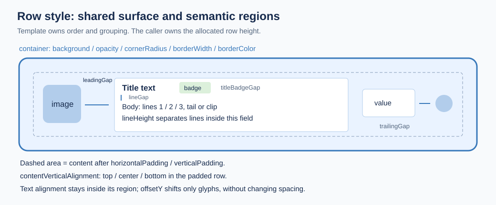

# NativeList Style Spec

Status: **shared style contract implemented on Web, iOS and Android through the
registered template renderers**. Consolidated on 2026-09-22 from PRs #107, #109,
#110, #111 and #112, on main `feac35eb6`; the renderer migration and its dated
per-stage runtime acceptance are recorded in [SPEC.md](SPEC.md) and
[DESIGN.md](DESIGN.md). The full §9 matrix (pixel parity, localized/RTL text and
font scaling on every template) has not been executed as one pass.
Use symbol names as source anchors. Tables of legacy defaults below are an
inventory, not evidence of three-platform visual acceptance.

This document is the shared design vocabulary for `@onekeyfe/react-native-native-list`.
iOS, Android, and Web each own a separate renderer, and nothing in the build forces
them to agree. This spec is therefore **authoritative by review, not by codegen**.
It records what a value is called, what it should be, and what each platform
currently does — so a divergence is visible in review instead of on a device.

See [DESIGN.md](DESIGN.md) for the architecture and ownership model.
Start with the [illustrated template catalog](ROW_TEMPLATES.md) for each template's
purpose, fields, variants, fixed structure and allowed local styling.

## 1. Why this exists

The current `RowModel` union declares **12** row types, including `walletGroup`
and the structural `sectionHeader`. Presentation variants are not additional row
types. Every
template hard-codes its own typography and geometry in three places, and the three
vocabularies have drifted:

- The package's theme keys and the application's design tokens are **two different
  names for the same colors**. Every consumer writes a mapping table by hand.
- The application has a named type scale (`$bodyMd`, `$headingSm`, …). The list has
  ten-plus bare font sizes and references the scale nowhere. "One step smaller" has
  no shared meaning.
- The same concept resolves to different numbers per platform (see §6).

This branch extends the original Market style API to the other row types. A
template defines structure; a local style parameter customizes a named part of
that structure. Header/footer placement, sections, scrolling and the indexed bar
belong to the list container, independently of the content template.

### 1.1 Ownership contract


| Owner | Responsibility | Must not control |
| --- | --- | --- |
| List container | Viewport, header/footer placement, sections, scroll position, refresh/load more, indexed bar and list chrome | The business meaning of a content row |
| Layout | Orientation, row allocation, grid spans/table columns, content padding and item spacing | Typography of a particular row field |
| Row template + variant | Slot order, hierarchy, required/optional fields, compression and bounded line counts | Whether the list has a header, footer, section index or scroll API |
| `row.style` | Allowlisted typography, colors, local metrics and explicit container height | Arbitrary children, flex direction, positioning, reparenting or list-level geometry |

**Normative requirement:** replacing an `identity` row with a `market` or
`dataRow` in the same valid container must not remove that container's common
capabilities. Compatibility conditions may depend on layout/orientation (for
example the indexed bar requires vertical sections), not a particular business
row template. This requirement does not claim every current renderer satisfies it.
Current API limits and implementation gaps are explicit in §5 and §6.5.

### 1.2 Row template and row style are different contracts

- **Row template** (`row.type` plus its declared `variant`/`presentation`) defines
  the content model and structure: slot order, hierarchy, optional parts, and
  interactions. `identity`, `market` and `dataRow` are templates. Changing a
  template is a model change, not a style change.
- **Row style** (`row.style`) customizes existing semantic fields and local
  metrics within that template. For example, `identity.style.title.fontSize`
  changes title typography; `image.width` changes the primary visual slot.
  A style cannot add a field, reorder slots or change a column's weight.
- **List capabilities** belong to the container. Header/footer placement,
  sections, scrolling, indexed bar, selection and list chrome do not belong to
  either a content template or its row style.

The configurable property names, valid values, semantic targets and precedence
are the same on Web, iOS and Android. A template exposes only parameters for parts
it owns. Unsupported keys are rejected by the shared validator before
serialization; optional or variant-specific parts that are absent are not created
by styling them. See the complete applicability matrix in §4.1.

The 12 templates each have a definition and schematic in ROW_TEMPLATES.md.
Overflow fitting remains the integrating developer's responsibility: choose
fitting text/image/padding values and row heights. `style.container.height` can
define a new row height; omission preserves the model/template measurement rules.
Existing measured templates account for explicit text/image/padding metrics.
Automatic overflow fitting, combination-fit rejection and automatic font shrinking
remain outside this contract.
The five source PRs are closed; implementation continues in the consolidated PR.

## 2. How this spec is enforced

The three renderers cannot constrain each other, but they all read the same
`snapshotJson`. That boundary is the single enforcement point.

| Layer | Enforced by | Covers |
| --- | --- | --- |
| Token names and values | `src/validation.ts` resolves tokens to numbers before serialization | §3 |
| Which keys a template accepts | `validateSnapshot` rejects keys not declared for that row type | §4 |
| Numeric bounds | `validateSnapshot` throws on out-of-range values | §3, §4 |
| Per-platform default values | **This document + PR review** | §4, §5 |
| Known divergences | **This document + PR review** | §6 |

A style token is resolved on the JavaScript side. `{ token: '$bodyLg' }` becomes
`{ fontSize: 16, lineHeight: 24, fontWeight: 'regular' }` before it crosses the
bridge — and an explicit `fontSize` alongside the token wins. Native renderers
never learn the token vocabulary and therefore cannot drift from it. Raw numeric
overrides stay available for pixel-parity work. Resolution is idempotent, and a
snapshot with nothing to resolve is returned unchanged, so the common path keeps
object identity.

### Status

| Layer | State |
| --- | --- |
| Per-template key validation, token resolution, patch support | Shared TypeScript/runtime contract; identical for all three renderers |
| Text roles and local box/image parameters | Implemented for the applicable template slots in §4.1; absent optional slots remain absent |
| `dataRow` column styles | Independent primary/secondary text on all platforms, in linear and table layouts |
| Sticky header styles | Android uses the same row view/binder as normal headers; iOS and Web also reuse their row renderers |
| `listStyle.separator` / `groupCornerRadius` | Initial/update propagation and actual-group scope aligned |
| Row heights and overflow | `style.container.height` overrides `row.height`; omission retains template measurement, including existing style-dependent sizing; caller owns content fitting |
| Legacy baseline dimensions | Inventory in §4/§6; explicit style values use logical units independently of Android's legacy list scale |
| Rendered acceptance | Per-stage renderer runtime cases are recorded in SPEC.md/DESIGN.md; source and unit checks alone do not establish the full §9 pixel/interaction matrix |

Each renderer maps its own model fields to owned views. There is no global
cross-template style-slot map or shared legacy text-view pool. §4 remains the
contract for the Swift, Kotlin and Web implementations; regression tests check
semantic isolation and style set/clear behavior.

The example application's **Native List Row Style** page has plain/styled pairs
for all 12 types, plus list chrome and an explicit-height example. Its wallet
group styles the parent member while leaving a child unstyled to expose leakage.
Migration/runtime acceptance is recorded in DESIGN.md; the checklist in §9 still
applies to future changes. The catalog
illustrations are structural diagrams, not screenshots or proof of rendering parity.

## 3. T1 — Design tokens

### 3.1 Color tokens

This table maps application token names to `NativeListTheme` keys by meaning.
It does not add runtime aliases: consumers still pass the actual theme keys and
resolved colors; `style.color` does not resolve application color-token names.

| Application token | `NativeListTheme` key | Role |
| --- | --- | --- |
| `text` | `primaryText` | Primary label |
| `textSubdued` | `secondaryText` | Secondary label |
| `textDisabled` | `disabledText` | Disabled / timestamp |
| `textInverse` | `inverseText` | Text on inverted ground |
| `textSuccess` | `positive` | Positive amount |
| `textCritical` | `negative` | Negative amount |
| `textCaution` | `caution` | Warning text |
| `textInfo` | `info` | Informational text, search highlight |
| `bgApp` | `background` | List ground |
| `bg` | `rowBackground` | Row ground |
| `bgActive` | `rowSelectedBackground`, `rowPressedBackground` | Selected / pressed row |
| `bgSubdued` | `subduedBackground` | Card and group ground |
| `bgStrong` | `strongBackground` | Chip / badge ground |
| `bgInverse` | `inverseBackground` | Inverted ground |
| `bgCriticalSubdued` | `criticalBackground` | Failed-state chip |
| `bgCautionSubdued` | `cautionBackground` | Caution chip |
| `borderSubdued` | `separator` | Separator, group border |
| `icon` | `icon` | Icon default |
| `iconSubdued` | `iconSubdued` | Secondary icon |
| `iconActive` | `accent` | Accent — **name mismatch, see §6** |

### 3.2 Typography scale

Sizes below are the application's scale. The "used by" column records which list
slots already sit on that step; slots that do not are listed in §4.

| Token | Size / line height | Weight | Used by |
| --- | --- | --- | --- |
| `$headingXl` | 24 / 32 | semibold | `metricCard.value` (size `large`) |
| `$headingLg` | 20 / 28 | semibold | — |
| `$headingMd` | 18 / 24 | semibold | `sectionHeader` gallery, `metricCard.value` |
| `$headingSm` | 16 / 24 | medium | `identity.title`, `market.title`, `market.price` |
| `$headingXs` | 14 / 20 | semibold | `message.title`, `sectionHeader` default |
| `$bodyLg` | 16 / 24 | regular | `action.title`, `sectionHeader` summary |
| `$bodyMd` | 14 / 20 | regular | `identity.subtitle`, `message.body`, `market.change` |
| `$bodySm` | 12 / 16 | regular | `rail.title`, `market.subtitle`, `identity.badge` |
| `$bodyXs` | 11 / 16 | regular | `metricCard` labels, `market` badges |

Weight names map to the bundled Roobert faces: `regular`, `medium`, `semibold`,
`bold`. No other family is available; `fontFamily` is not part of the style surface.

### 3.3 Spacing, radius, bounds

| Kind | Allowed values | Bound |
| --- | --- | --- |
| Padding / gap | finite number | `0…64` |
| `lineGap` (title to subtitle) | finite number | `0…16` |
| Font size | finite number | `8…48` |
| Line height | finite number | `8…64` |
| Corner radius | finite number | `0…80` |
| Image edge | finite number | `1…160` |

These are the validator's numeric bounds, not a guarantee that every combination
fits a row. Fractional values are accepted; native rounding can differ. See §7.1
for the stronger layout-safety contract and its current enforcement limits.

Radius steps in use: `4` (chip), `8` (rail, small visual), `10` (visual `rounded`),
`12` (row, card), `16` (media tile), `20` (wallet sidebar row on iOS only — §6).

## 4. T2 — Template style surface

`style.X` modifies the rendering of the **model field named `X`**, regardless of
which physical view carries it. Each registered template renderer owns its views
and maps the key to the view rendering that field. The removed legacy native
views shared slots (for example legacy `metricCard` rendered its *value* through
the title label and its *title* through the subtitle label), which is why style
keys were never named after views. `market` follows the same rule with
`style.price` / `style.change`.

On Web the element rendering a field carries `data-nl-slot="<field>"`, so the
style pass resolves a slot by name rather than by CSS class — on its own,
`.ok-native-list-secondary` is the identity subtitle, the rail status, a metric
label, a data column's secondary text, and a system message. iOS and Android express
the same semantic mapping in native code. Singular style roles such as `badge`
and `value` can refer to repeated badges or values in `trailing`; their precise
meaning is defined in the [catalog](ROW_TEMPLATES.md).

### 4.1 Shared configurable properties

Every text role listed below accepts the same `NativeListTextStyle`:
`token`, `fontSize`, `fontWeight`, `color`, `lineHeight`, `lines`, `truncate`,
`alignment`, `verticalAlignment`, `offsetY`.
Weights are `regular | medium | semibold | bold`; line counts are `1 | 2 | 3`;
`start | center | end` alignment follows layout direction on all three
platforms (`end` is the left edge in RTL). Colors must be
`#RRGGBB` or `#RRGGBBAA`, the common native/Web color format. Omitted properties
preserve the template's values. Explicit properties override token values,
presentation defaults and rich-text runs only for that property.

Every supported image role accepts `width`, `height`, `shape`, `cornerRadius`,
`contentFit`. Shape is `circle | rounded | square`; explicit corner radius wins.
Fit is `cover | contain | fill | center`. These parameters target the primary
visual, not network badges, corner decorations, message thumbnails or nested
metric images. A media tile keeps its square default when only width is set;
an explicit image height overrides that aspect. Image/text/padding metrics can
participate in an existing intrinsic/measured template, such as Market or message.
They do not override an explicit row height. Use `style.container.height` to
define a new outer height for any template.

In the matrix, **padding** means both `horizontalPadding` and `verticalPadding`.
Each cell describes the same public contract on **Web + iOS + Android**.

| Template | Semantic text roles | Local box/image properties |
| --- | --- | --- |
| `identity` | title, subtitle, tertiary, badge, value, valueSecondary | padding, leadingGap, lineGap, titleBadgeGap, trailingGap, image |
| `walletGroup` | None; members own their identity styles | padding |
| `rail` | title, badge, status | padding, leadingGap, titleBadgeGap, trailingGap, image |
| `activity` | title, description, status, primaryAmount, secondaryAmount | padding, leadingGap, lineGap, trailingGap, image |
| `message` | title, body, time | padding, leadingGap, lineGap, image |
| `dataRow` | columns, columnSecondary, index | padding, leadingGap, lineGap, titleBadgeGap, image |
| `market` | title, subtitle, price, change | padding, leadingGap, lineGap, titleBadgeGap, trailingGap, image; Market-specific properties below |
| `mediaTile` | title, subtitle, badge | padding, leadingGap, lineGap, image |
| `metricCard` | title, value, subtitle, trend | padding, leadingGap, lineGap, image |
| `sectionHeader` | title, subtitle, value | padding, lineGap, trailingGap |
| `action` | title, value | padding, leadingGap, trailingGap, image |
| `system` | title, message, actionText | padding, lineGap |

Market additionally exposes `titleBadgeLayout: inline`, `contentTrailingGap`,
`subtitleTrailingPadding`, `changeWidth`, `changeHeight`, `changeCornerRadius`, preserving
its existing template-specific style surface on every platform.

Gap meanings are structural: `leadingGap` separates the primary visual from
content; `lineGap` separates content text rows (primary/secondary per data column);
`titleBadgeGap` separates a title and its badges (vertical for walletSidebar);
`trailingGap` separates trailing values/controls (title/badge to status for rail).
`walletGroup` padding applies only to the group; it never cascades into members.
Composite metric-card `lineGap` separates heading/metric blocks and dividers; it
does not change the typography or inner label/value gap of each metric.

Variant applicability is also shared: composite metric-card `title` styles its
heading, while standard-card `value`/`subtitle`/`trend` do not style nested metrics;
`system.title` applies to warning, `actionText` to the native retry button. Web
(legacy) draws no retry button for any presentation, so `style.actionText` has
no Web target and is ignored there; iOS/Android style their button. A missing leading visual,
badge, subtitle or trailing value remains absent. New nested-metric/thumbnail
style roles require a separately declared cross-platform contract.

All numeric overrides use logical units (CSS px / iOS pt / Android dp), including
explicit typography. Legacy Android scaling may affect omitted defaults, but must
not rescale an explicit style value. Physical-pixel/font-rasterization differences
remain platform-specific. See §3.3 for bounds and §7 for fitting responsibility.

### 4.1.1 Row container (all 12 templates)



`style.container` addresses the outer row surface, including `walletGroup` and
rows used as headers/footers. It never overwrites member styles; opacity naturally composites the entire
container including descendants.

| Property | Values / default when supplied | Meaning |
| --- | --- | --- |
| `height` | `0…4096` logical units | Explicit row allocation; takes precedence over `row.height` and template measurement |
| `backgroundColor` | `#RRGGBB` / `#RRGGBBAA` | Resting row background |
| `opacity` | `0…1` | Opacity of the whole row, multiplied by disabled dimming |
| `cornerRadius` | `0…80` logical units | All four outer row corners |
| `borderWidth` | `0…8` logical units | Inward border; no effect on content allocation |
| `borderColor` | `#RRGGBB` / `#RRGGBBAA` | Border color; transparent if width is supplied alone |
| `contentVerticalAlignment` | `top / center / bottom` | Align the row's content within its padded height; preserve slot order and orientation |

Omission preserves the template's existing value. Explicit container background
and opacity take precedence over legacy `row.backgroundColor` / `row.opacity`.
Existing top-level fields remain accepted; new integrations use `style.container`.
An explicit background is the resting surface (including selection); existing
pressed feedback remains visible. Radius and border remain during press/selection.
Explicit radius overrides grouped corner geometry for this row only; it does not
change `listStyle.groupCornerRadius`. `backgroundFullWidth` remains a layout/model
option and uses the resolved resting background. A border never changes padding.

`horizontalPadding` / `verticalPadding` remain on `row.style`; there is no second
padding entry under `container`. Outer margin, width, positioning, visibility,
flex direction, column weights and independent hit-area changes are not container
style properties. `height` changes the row frame and its normal row hit area; it
does not rearrange slots or resize their contents.
Shadows, gradients and per-corner/per-edge styling are outside this version.

```ts
// Inside an identity row; the style itself can allocate a new row height.
style: {
  container: {
    height: 112, backgroundColor: '#EDF6FF', cornerRadius: 12,
    borderWidth: 1, borderColor: '#8DB7E4', contentVerticalAlignment: 'center',
  },
  horizontalPadding: 16, verticalPadding: 12, leadingGap: 10, lineGap: 4,
  title: { lines: 1, truncate: 'tail', alignment: 'start' },
  subtitle: { lines: 3, truncate: 'clip', lineHeight: 18, offsetY: -1 },
}
```

### 4.1.2 Text wrapping, truncation and alignment

| Property | Shared meaning |
| --- | --- |
| `lines` | Maximum 1, 2 or 3 lines, not a forced reservation of that many lines |
| `truncate` | `tail` (ellipsis at the end of the last visible line) or `clip` (no ellipsis); default `tail` when line/truncation controls are supplied |
| `lineHeight` | Line box height inside one text field, distinct from `lineGap` between fields |
| `alignment` | Horizontal `start / center / end` inside the text region, respecting direction |
| `verticalAlignment` | `top / center / bottom` for the complete text block inside its allocated text region; no effect without spare height |
| `offsetY` | `-8…8` logical units of optical translation; does not change measurement, sibling spacing or hit areas |

Single-line text does not wrap; explicit CR/LF line breaks become spaces (CRLF is
one break). Multi-line text wraps naturally, preserves explicit breaks, and
truncates after the last permitted line. Rich runs share one line budget. Styling
one field must not alter adjacent badges, values or member rows. Middle/head
truncation is not exposed in this version; it needs a separate cross-platform
contract rather than platform-specific fallback.

Every existing declared text role accepts the same range `1…3`; each template's
omitted defaults remain documented in the inventory. Optional absent fields stay
absent. `style.title.lines` overrides legacy `titleLines`,
`style.subtitle.lines` overrides `subtitleLines`, and `style.body.lines` overrides
`message.bodyLines`. New callers should use styles for all three. Removing a
style restores the model/default value. `patch.changes.style` replaces the whole
style object; `{}` clears it, including container and text overrides.

Height precedence is `style.container.height` → `row.height` → existing
template/layout measurement. A style height is an exact logical height, not a
minimum. It applies to every template, normal rows, grid/horizontal layouts,
wallet members, sticky headers and fixed footers. Clearing the whole style or
omitting `container.height` restores the original model height or measurement;
the original `row.height` is never rewritten. Wallet-group compact reorder keeps
its temporary drag height and restores the styled height afterward. Android
uses unscaled logical dp, with `heightRounding` when supplied (nearest otherwise).

An explicit height is not automatically expanded. With neither explicit height,
styles may change an existing measured/intrinsic row height. Existing intrinsic/measured
paths must account for explicit text metrics within their declared measurement
model. Font shaping and exact wrap points can vary across platform fonts; the
property meanings and maximum line counts must agree.

`container.contentVerticalAlignment` moves the existing content arrangement as a
whole within the row; text `verticalAlignment` moves only that field's glyph block.
They must not be substituted for each other. For horizontal rows, the container
alignment aligns existing immediate content groups on the vertical axis.

### 4.1.3 Spacing and admission rules

Spacing is always between named semantic regions, never arbitrary descendants:
`leadingGap` is visual-to-content, `titleBadgeGap` is title-to-badge, and
`trailingGap` is between the template's trailing items (rail: title/badge-to-status).
`lineGap` is between text fields; the existing composite metric variant explicitly
uses it between its heading/metric blocks. New templates must identify both
endpoints in their diagram and must not invent a different meaning for these keys.
List `layout.itemSpacing` remains the gap between rows.

Before adding a template or style property, update the catalog with its diagram,
semantic fields, defaults, applicable variants, units/ranges, precedence and
absent-field behavior. Reuse this shared text/image/container vocabulary. A new
property requires Web/iOS/Android implementations, validation for snapshot and
patch paths, and focused checks for replacement/reset, recycling, rich text,
member isolation, sticky headers and fixed footers where applicable. Source/build
checks and rendered acceptance must be reported separately. No renderer may
silently reinterpret an unsupported value.

### 4.2 Existing defaults (inventory, not a pixel parity claim)

Legend: **=** inventoried defaults agree; **≠** legacy divergence, see §6.

### identity

| Key | Default | iOS | Android | Web |
| --- | --- | --- | --- | --- |
| `title` | `$headingSm` | 16 medium / 24 | sp(16) medium / dp(24) | 16px / 20px / 600 **≠** |
| `subtitle` | `$bodyMd` | 14 regular / 20 | sp(14) regular / dp(20) | 14px / 20px **=** |
| `tertiary` | `$bodyMd` | 14 regular / 20 | sp(14) / dp(20) | 14px / 20px **=** |
| `subtitle` lines | model `subtitleLines` | default 1 | default **2** | default 1 **≠** |
| `badge` | `$bodySm` | 12 medium / 16, pad 8/2, r4 | sp(12) / dp(16), pad 8/2, r4 | 11px / 18px, pad 0 5, r5 **≠** |
| `value` | `$headingSm` | 16 medium | sp(16) medium / dp(24) | 14px / 20px / 500 **≠** |
| `valueSecondary` | `$bodyMd` | 14 regular | sp(14) regular / dp(20) | 14px **=** |
| box | pad 12/8, gap 12 | 12 / -12 / 8 / -8, spacing 12 | dp(12), dp(8) | `padding:8px 12px`, `gap:12px` **=** |
| `image` | 40 | 40×40 (32 for `network`) | 40 (32 for `network`) | 40px (32px for account) **=** |

### identity · presentation `walletSidebar`

| Key | Default | iOS | Android | Web |
| --- | --- | --- | --- | --- |
| `title` | `$bodySm` | 12 regular / 16, centered | sp(12) / dp(16), centered | 12px / 16px / 400 **=** |
| `badge` | `$bodyXs` | 11 / 14, pad 6/2, r4 | sp(11) / dp(14), pad 6/2, r4 | 11px / 14px, pad 2 6, r4 **=** |
| `image` | 40 | 40×40, fallback 28 | 40, fallback sp(28) | 40px **=** |
| box | pad 4 | 4 / -4 / 4 / -4 | dp(4) × 4 | `padding:4px 8px` **≠** |
| row radius | 12 | 20 | 12 | 12 **≠** |

### identity · presentation `accountSelector`

| Key | Default | iOS | Android | Web |
| --- | --- | --- | --- | --- |
| `title` | `$bodyLg` | 16 regular | sp(16) regular | 16px / 20px / 400 **=** |
| `subtitle` | `$bodyMd` | 14 regular / 20 | sp(14) / dp(20) | 14px / 20px / 400 **=** |
| `image` | 32 | 32×32 | 32 | 32px **=** |
| trailing icon | 38 | 38, margin −7 | dp(38), margin −dp(7) | 38px, margin −7px **=** |

### identity · presentation `networkSelector`

| Key | Default | iOS | Android | Web |
| --- | --- | --- | --- | --- |
| `title` | `$headingSm` | 16 medium / 24 | sp(16) / dp(24) | 16px / 24px / 500 **=** |
| `image` | 32 | 32×32, fallback 19/27 semibold | 32, fallback sp(19)/dp(27) | 32px, fallback 19/27/600 **=** |
| checkbox | 20, r4, border 2 | 20×20, r4, border 2 | dp(20), r4f, stroke dp(2) | 20px, r4, border 2px **=** |

### walletGroup

| Key | Default | iOS | Android | Web |
| --- | --- | --- | --- | --- |
| member gap | 12 | stack spacing 12 | topMargin dp(12) | `gap:12px` **=** |
| container radius | 12 | 20 | dp(12) | 12px **≠** |
| container border | 1, `borderSubdued`, drawn beneath members | 1 | dp(1) | 1px **=** |
| compact drag height | 68 | 68 | max(68, parent + 2 × inset) | 68 **≠** |

### rail

| Key | Default | iOS | Android | Web |
| --- | --- | --- | --- | --- |
| `title` | `$bodySm` | 12 medium / 16 | sp(12) / dp(16) | 12px / 500 **=** |
| `badge` | `$bodySm` | 12 medium / 16 | sp(12) medium / dp(16) | — |
| `status` | `$bodySm` | 12 regular / 16 | sp(12) | — |
| box | pad 4, gap 6 | 4 / -4, spacing 6 | dp(4), spacing 6 | `padding:4px;gap:6px` **=** |
| `image` | 20 | 20×20 | 20 | 20px **=** |
| row radius | 8 | 8 | 8 | 8px **=** |

### activity

| Key | Default | iOS | Android | Web |
| --- | --- | --- | --- | --- |
| `title` | `$headingSm` | lineHeight 24 | dp(24) | 16px / 20px **≠** |
| `description` | `$bodyMd` | lineHeight 20, 2 lines | dp(20), 2 lines | 14px / 20px **=** |
| `primaryAmount` | `$headingSm` | 16 medium / 24, tabular | sp(16) medium / dp(24) | 16px / 20px **≠** |
| `secondaryAmount` | `$bodyMd` | 14 regular / 20, tabular | sp(14) / dp(20) | 14px **=** |
| footer action | `$bodyMd` | 12 medium, r8, pad 4/8 | sp(14) semibold, r8f, pad 8/4 | 12px / 16px / 600 **≠** |

### message

| Key | Default | iOS | Android | Web |
| --- | --- | --- | --- | --- |
| `title` | `$headingXs` | 14 semibold / 20, 2 lines | sp(14) semibold / dp(20) | 15px / 20px / 600 **≠** |
| `body` | `$bodyMd` | 14 regular / 20 | sp(14) / dp(20) | 13px / 18px **≠** |
| `time` | `$bodySm` | 12 / 16, `textDisabled` | sp(12) / dp(16), `disabledText` | 11px / 16px **≠** |
| `image` | 28 | 28×28 | 28 | 40px **≠** |
| thumbnail | 64, r6 | 64×64, r6 | dp(64), r6f | 64px, r10 **≠** |
| box | pad 12/16 | 16 / -16 | dp(12), dp(16) | `padding:8px 12px` **≠** |

### dataRow

| Key | Default | iOS | Android | Web |
| --- | --- | --- | --- | --- |
| `columns` (linear) | `$bodyMd` | 14 medium / 20 | sp(16) medium / dp(20) | 16px / 500 **≠** |
| `columns` (table) | `$bodyMd` | 14 medium / 20 | sp(14) medium / dp(20) | 16px / 500 **≠** |
| column secondary | `$bodySm` | 12 regular / 16 | sp(12) / dp(16) | — |
| `index` | `$bodySm` | — | dp(32) slot | 13px, 28px slot **≠** |
| favorite icon | 20 | 20×20 | dp(20) | 24px / 22px glyph **≠** |
| box | pad 12/6 | table 20/10 | table dp(20)/dp(10) | `padding:6px 12px` **=** |

### market

Already fully data-driven through `MarketRowStyle`. The values below are the
defaults applied when `style` is absent.

| Key | Default | All platforms |
| --- | --- | --- |
| `title` | `$headingSm` | 16 / 24 / medium |
| `subtitle` | `$bodyMd` | 14 / 20 / regular |
| `price` | `$headingSm` | 16 / 24 / medium |
| `change` | `$bodyMd` | 14 / 20 / medium, block 80×32 r8 |
| box | pad 20/12, gap 14 | perp 16, gap 8 |
| `image` | 32 (stock 40) | circle |

### mediaTile

| Key | Default | iOS | Android | Web |
| --- | --- | --- | --- | --- |
| `title` | `$headingSm` | 16 medium / 24 | sp(16) / dp(24) | 16px / 500 **=** |
| `subtitle` | `$bodySm` | 12 regular / 16 | sp(12) / dp(16) | 12px **=** |
| `badge` | `$bodyMd` | 14 medium, h24, r10 | sp(14), h dp(24), r10f | — |
| image radius | 10 | 10 | dp(10) | 10px **=** |
| tile radius | 16 | 16 | 16 | 16px **=** |
| network badge | 14 | 14×14, r7 | dp(14), circle | 14px, r50% **=** |

### metricCard

`title` is the small label; `value` is the large number. Style keys follow these
model fields, whatever the renderer's internal view names are.

| Key | Default | iOS | Android | Web |
| --- | --- | --- | --- | --- |
| `title` | `$bodyXs` | 11 regular, `textDisabled` | sp(11), `disabledText` | 14px **≠** |
| `value` | `$headingMd` | 18 semibold (24 when `size: large`) | sp(18) / sp(24) semibold | 22px / 28px / 700 **≠** |
| `trend` | `$bodySm` | 12, tone colored | sp(12), tone colored | — |
| metric label | `$bodyXs` | 11 regular / 14 | sp(11) / dp(14) | — |
| metric value | `$bodyMd` | 14 medium / 20 | sp(14) medium / dp(20) | 18px / 600 **≠** |
| card padding | 14 | 14 | dp(14) | 12px **≠** |
| card radius | 12 | 12 | 12 | 12px **=** |
| progress bar | 4, r2 | 4, r2 | dp(4), r dp(2) | 4px, r2 **=** |

### sectionHeader

| Variant | Default | iOS | Android | Web |
| --- | --- | --- | --- | --- |
| default | `$headingXs` | 14 semibold / 20 | sp(14) semibold / dp(20) | 13px / 18px / 700 **≠** |
| `summary` | `$bodyLg` | 16 medium / 24 | sp(16) medium / dp(24) | 16px / 500 **=** |
| `gallery` | `$headingMd` | 18 semibold / 24 | sp(18) semibold / dp(24) | 16px **≠** |
| `history` | `$bodySm` | 12 semibold / 16, tracking 0.8 | sp(12) semibold / dp(16), tracking 0.8 | 12px / 16px **=** |
| table layout | `$bodyXs` | 11 regular / 14 | sp(11) regular / dp(14) | — |
| `value` | `$bodyLg` | 16 / 24 | sp(16) medium / dp(24) | 14px / 20px / 500 **≠** |

### action

| Key | Default | iOS | Android | Web |
| --- | --- | --- | --- | --- |
| `title` | `$bodyLg` | 16 / 24 | sp(16) / dp(24) | 15px / 600 **≠** |
| `title` (accountSelector) | `$bodyLg` | 16 medium / regular | medium / regular | 16px / 24px / 400 **=** |
| icon slot | 40 (32 accountSelector) | 40 / 32, glyph 24 | 40 / 32, glyph dp(24) | 40px / 32px **=** |
| box | pad 16 | — | — | `padding:0 16px` **=** |

### system

| Variant | Default | iOS | Android | Web |
| --- | --- | --- | --- | --- |
| `loading` skeleton | — | marks 32 / 80×16 / 60×12 / 80×18 | same | same **=** |
| `loading` spinner | 20 | 20, market 32 | dp(20), market 32 | 20px, market 32px **=** |
| `retry` | `$bodyMd` | 14 medium / 20, r14 | sp(14) / dp(20), r16f | 12px **≠** |
| `noMatch` / `end` | `$bodyMd` | 14 regular / 20 | sp(14) / dp(20) | 14px **=** |
| `warning` | `$bodyMd` | 14 medium + regular / 20 | sp(14) / dp(20) | 14px / 20px **=** |
| `spacer` | — | `height` only | `height` only | `height` only **=** |

### Carrier coverage

Rows in `snapshot.rows`, `snapshot.fixedFooter`, and `snapshot.emptyState` reuse
the row binders. The two standalone descriptors currently accept only `action`
or `system` in the public TypeScript API. `sectionHeader` is a structural row in
`rows`. Reusing a binder does not transfer ownership of footer positioning,
empty-state placement or header pinning to the row template. Android's pinned
header reuses the ordinary header row view and callbacks (§6.3).

## 5. T3 — List chrome

Chrome is not part of a row. This branch has `snapshot.listStyle` for separator
inset/color and grouped-card radius. Common capabilities remain in their existing
container APIs; being public does not require placing everything in `listStyle`.

### 5.1 Common capabilities and current API

| Capability | Existing entry point | Contract and current limit |
| --- | --- | --- |
| List header | Leading structural/summary rows; `CollapsiblePagerView.header` and `stickyHeader` for composed React content | Header placement belongs to the container. There is currently **no generic public `listHeader`/`ListHeaderComponent` prop**; arbitrary React children inside NativeList are not part of the current template API |
| List footer | A trailing `action`/`system` row scrolls with content; `snapshot.fixedFooter` stays outside the scrolling rows | Available independently of the content row type. `fixedFooter` currently accepts only `ActionRow \| SystemRow`; row style controls its content, not its fixed placement |
| Sections / sticky headers | `layout.kind: 'sectioned'`, `sectionHeader.sectionKey`, member `sectionKey`, `layout.stickyHeaders`, header `sticky` | A section can contain different content templates. `sectionHeader` describes the heading; the container owns membership, positioning and pinning. Complex headers share the normal row renderer when pinned; summary headers remain non-sticky on all three platforms (§6.3) |
| Scroll and restoration | `NativeListRef.scrollToKey/Index/Item/Offset/End/Location`, `initialScrollKey/Index` and view position/offset props | Shared viewport behavior, independent of row template. Style must not silently change measured offsets or invalidate stable row keys |
| Indexed bar | `capabilities.sectionIndex`, `sectionHeader.indexTitle`; Web has `webSectionIndexContainerRef` | Requires vertical `sectioned` layout; entries follow indexed header order and target header keys. No dependency on `identity`, `market`, or another content template |
| Refresh / pagination | `capabilities.pullToRefresh/refreshing/loadMore/endReachedThreshold`, `onRefresh`, `onEndReached`, `setRefreshing` | Container gestures/state; indicator implementation may differ by platform |
| Empty state | `snapshot.emptyState` (`ActionRow \| SystemRow`) | Container decides when to display it, independently of the regular content templates |
| Selection / reorder | `snapshot.selection`, `capabilities.reorderable`, selection/reorder events | Common orchestration; each row's available controls/draggable support still depend on its declared model |
| Separator / grouped cards | `listStyle`, row `separator`, `groupId` and `groupPosition` | Styling scope is the list; group membership is data. A custom group radius must not change unrelated template cards |

The header/footer slots in the diagram are ownership boundaries, not newly
available props. Do not introduce `marketHeader`, `identityFooter`, or per-template
scroll/index configuration. A future public header or broader footer carrier must
extend the container contract once, with the same placement rules for all content.

`activity.footerActions` means buttons **inside one activity row**. It is unrelated
to the list footer. Similarly, `walletGroup` is a composite wallet template, not
the list's general section mechanism.

### 5.2 Chrome surface

| Item | Data-driven today | iOS | Android | Web |
| --- | --- | --- | --- | --- |
| Content padding | yes (`layout.contentPadding*`) | `contentInset` | `setPadding` | `paddingValues` |
| Item spacing | yes (`layout.itemSpacing`) | flow layout spacing | `ItemSpacingDecoration` | layout gap |
| Separator | **yes** — `listStyle.separator.{inset,color}` | 1/scale, inset 60/12 | 1px, inset dp(60)/dp(12) | `1px`, class rule, **no inset** |
| Group card radius | **yes** — `listStyle.groupCornerRadius` | 20 / 12 | dp(12) | 12px |
| Section index rail | partial (`capabilities.sectionIndex`) | static constants, label 10 | `SECTION_INDEX_*_DP`, raw density | `SECTION_INDEX_*` + CSS |
| Section index preview | no | 48×48 r14, 22 semibold | preview w/h/margin constants | 48px r14, 22px |
| Pull to refresh | partial (`capabilities.pullToRefresh`) | `UIRefreshControl` | `SwipeRefreshLayout` | custom pill, 12px |
| Reorder preview | no | — | — | r12, shadow `0 4px 24px` |
| Reorder count badge | no | 24 h, r12, 12 semibold | dp(24), r dp(12), sp(12) semibold | 24px, r12, 12/22/600 |

The section index rail is three separate constant sets for one control; Android's
`sectionIndexDp()` deliberately never follows the source-scale switch.

`listStyle` carries only what all three platforms can honour. The rest of this table
is deliberately excluded rather than declared and half-implemented:

- **Pull to refresh** is a system control on both native platforms (`UIRefreshControl`,
  `SwipeRefreshLayout`); only Web draws its own indicator.
- **Section index rail and preview** belong to `capabilities.sectionIndex`, which is
  where their geometry should go if it is ever exposed, and are three independent
  constant sets today.
- **Reorder preview and count badge** are drawn with platform-specific primitives —
  Android paints the badge on `Canvas` inside `dispatchDraw`, Web uses a CSS overlay,
  and iOS has neither.
- **Content padding and item spacing** are already `layout.contentPadding*` and
  `layout.itemSpacing`; duplicating them here would give one value two homes.

Validated values: `separator.inset` is `0…64` logical units; `separator.color`
must be `#RRGGBB` or `#RRGGBBAA`, the same format as every row style color;
`groupCornerRadius` is `0…40` logical units. Any other `listStyle` or separator
key is rejected.

Every `listStyle` value is absent by default, and each platform keeps its own number
as the fallback, so an untouched list renders exactly as before. On Web that required
the inset separator to keep the transparent `border-bottom` for layout and paint the
visible line with a logical-inset overlay, rather than moving the row by a pixel.

## 6. T4 — Known divergences

Registered, **not** fixed by this document. Changing any of these requires a PR
that cites this table and carries device verification.

### 6.1 Row heights

Row height is computed from data by three independent implementations —
the iOS registered renderer measurement, Android registered row measurement, and
Web registered estimate/DOM measurement. Preserved defaults still differ:

| Template | iOS | Android | Web |
| --- | --- | --- | --- |
| `rail` | 40 | 28 | 40 |
| `activity` + footer actions | 100 | 104 | 100 |
| `dataRow` linear, no secondary text | 56 | 56 | 56 |
| `dataRow` linear + secondary text | 60 | **64** | 60 |
| `dataRow` table, no secondary text | 48 (56 − 8) | **52** (60 − 8) | 48 (56 − 8) |
| `dataRow` table + secondary text | 60 | 60 | 60 |
| `sectionHeader` `summary` | 68 | 80 | 68 |
| `sectionHeader` value + checkbox | 56 | 40 | 56 |
| `message`, `mediaTile`, composite `metricCard` | computed / 244 / 160+ | 0 (wrap content) | computed / 244 / 161 |

DataRow provenance (pre-migration engines at `52849b86f`): iOS
`RNCNativeListView.rowHeight()` used base 56, or 60 with secondary text, then
−8 in table layout without secondary text; legacy Web applied the same rule.
Android `NativeListRowView` used base 60 for every table row (−8 without
secondary text) and 64/56 for linear rows with/without secondary text. The
registered renderers return these values directly; `size` and explicit heights
apply as for other templates.

Message now uses its resolved text/spacing/image metrics for intrinsic
measurement; iOS measures the actual allocated column width and Web corrects
its conservative estimate from the rendered DOM. This explicitly fixes the old
Message estimator-only fallback differences. Explicit/model heights keep their
precedence. Other legacy mismatches remain: iOS `bindSystem()` uses 52/120 for a
market retry row where `rowHeight()` uses 44, and 88 for `noMatch` where
`rowHeight()` uses 44.

These values may have been tuned per platform on real devices. They are recorded
here and left alone.

### 6.2 Typography and geometry

| Concept | iOS | Android | Web |
| --- | --- | --- | --- |
| `identity.title` | 16 medium / 24 | sp(16) medium / dp(24) | 16px / **20px** / **600** |
| `identity.badge` | 12 / 16, pad 8/2, r4 | sp(12) / dp(16), pad 8/2, r4 | **11 / 18, pad 0 5, r5** |
| `message.body` | 14 / 20 | sp(14) / dp(20) | **13 / 18** |
| `message` leading | 28 | 28 | **40** |
| `sectionHeader` default | 14 semibold / 20 | sp(14) semibold / dp(20) | **13 / 18 / 700** |
| `action.title` | 16 / 24 | sp(16) / dp(24) | **15 / 600** |
| `metricCard.value` | 18 semibold | sp(18) semibold | **22 / 28 / 700** |
| visual `rounded` radius | `min(10, h/4)` | `min(10, size/4)`; 8 for accountSelector | **10px**; 8 `!important` for account action; 8 for market |
| `walletSidebar` row radius | **20** | 12 | 12 |
| `identity` subtitle lines (no `subtitleLines`) | 1 | **2** | 1 (CSS single line) |
| pressed row corners | 12 all corners (rail 8, mediaTile 16 resting, wallet sidebar **20**), ignoring `groupPosition` | 12 all corners (rail 8, mediaTile 16 resting); no wallet-sidebar exception | background only; resting group/template radius kept **≠** |
| `walletGroup` row `backgroundColor` | ignored (`style.container.backgroundColor` or theme `subduedBackground`) | ignored (same) | applied inline **≠** |
| `walletGroup` `row.height` | ignored (members / `style.container.height`) | ignored (same) | honored **≠** |
| System retry | literal "Retry" button (non-Market); `actionText` button (Market) | same as iOS | no button for any presentation; message only, row press retries **≠** |
| separator default inset | 60 identity / 12 | dp(60) identity / dp(12) | **0** |
| separator thickness | `1 / scale` (hairline) | `1f` raw px | `1px` |

Separator inset and colour are now settable through `listStyle.separator` (§5); the
defaults above are what a list gets when it does not set them. Thickness is not
exposed — a hairline is correct on iOS and a whole pixel is correct elsewhere.

### 6.3 Behavioral

- **Android pinned headers reuse normal row rendering.** The old Canvas-only
  `StickySectionHeaderDecoration` is replaced by an overlay registered `NativeListSectionHeaderRowView`.
  Typography, local metrics, values, checkbox/action callbacks and theme now follow
  the same binding path. The overlay pushes away for the next sticky header and
  forwards drag gestures to the RecyclerView. Summary and `sticky: false` headers
  are excluded consistently. Device touch/accessibility acceptance remains required.
- **Source scale is list-wide on Android.**
  `usesSelectorSourceScale` is computed with `items.any { … }`, so one selector row
  switches the metric system (the sub-400dp 0.9 factor) for the entire list.
  Only the legacy `row.height` (a WalletGroup's parent `height`) triggers it;
  `style.container.height` switches its own row to selector explicit-height
  geometry (as on iOS and Web) but never this list-wide metric system (§7 rule 3).
  `NativeListTableColumnView`, the market skeleton, and the section index never
  follow it. Explicit non-Market row styles now use density directly, so this
  legacy baseline policy cannot scale an explicitly supplied style value.
  Under source scaling, accountSelector/networkSelector/walletSidebar rows apply
  the legacy selector typography (whole-pixel unscaled size, fractional advances,
  original line box) to every text in the row, including trailing accessory
  text and the action leading fallback text; a `fontSize` or `lineHeight` set in
  that slot's style is applied as given. A walletSidebar leading visual under
  source scaling draws a 1dp dashed border (else 2dp); its text-only overlays
  are 16dp pills with 12sp text on a 16dp line, and other text overlays use 10sp.
- **`accent` is not an accent.** The consumer maps the application's `iconActive`
  onto the theme key `accent`. The name should be retired in favour of an alias.

### 6.4 Load-bearing oddities (do not "clean up")

- `.ok-native-list-account-action-row .ok-native-list-visual{border-radius:8px!important}`
  overrides an **inline** radius written by `createVisual`. Removing `!important`
  regresses the account action row to 10px.
- `.ok-native-list-market-change{color:#fff;background:#8d8d8d}` are literals, not
  tokens, because `--nl-inverse-text` defaults to `#fcfcfc` and `--nl-secondary` to
  `#6b7280`. Swapping them changes untinted rendering.

### 6.5 Consolidated gap audit

| Former gap | Resolution in source | Remaining verification |
| --- | --- | --- |
| Non-Market box/image parameters accepted without effect | Per-template allowlists and native/Web geometry/image mappings; properties for nonexistent template parts rejected | Native image loading, decoration clipping and variant geometry |
| Native table and secondary-column styling | Separate primary/secondary labels in linear and table layouts; styles target only their semantic text | Rendered alignment and reuse in both native layouts |
| Missing semantic text targets | Activity status, rich identity subtitles, wallet badges, retry action and composite heading routed to actual fields | Device variant coverage |
| Selector defaults overwrite styles | Explicit style applied after defaults; summary/selection updates restore and reapply styles | Rapid selection/summary updates on device |
| Native reuse leaks | Restore the actual bound text and local geometry before rebinding; preserve unspecified rich-text attributes | Styled → unstyled → another template during scrolling |
| Android sticky header uses a separate partial renderer | Normal row view renders pinned text, values and controls | Pin/push-off, checkbox/action taps, scrolling and accessibility |
| List chrome propagation and group scope | Initial/update paths receive listStyle; custom radius only applies to actual groups | Initial and chrome-only snapshot interactions |
| Parent style cascades to wallet members | Group exposes container appearance and padding; members bind their own styles | Independent group/member styling during reorder |
| Row container surface | Shared `style.container`, explicit height and appearance precedence, disabled opacity, border/radius and content alignment | Press/selection/reorder and nested members on device |
| Text line controls | Shared 1–3 lines, tail/clip, vertical alignment and optical offset; measured text paths updated | Long/CJK/RTL/rich text and fixed-height clipping on device |

### 6.6 Follow-up source audit (2026-09-22)

| Difference found | Repair |
| --- | --- |
| Web clip height guessed before CSS was mounted; iOS clip disabled natural wrapping | CSS line-height-relative clipping and iOS wrapping without ellipsis |
| Web ignored legacy identity line limits and Market badge metrics | Apply declared fields with style precedence and restore defaults on clear |
| Market rich subscripts retained their old size despite explicit font size | Superseded 2026-09-24: legacy (all platforms) sized a subscript at `ceil(0.6 × field fontSize)`. Web, iOS and Android restore that ratio for an explicit `fontSize` (native keeps the field line height, Web a `fontSize` line box, each as in legacy) |
| Web Market center fit used an invalid CSS value; change color used reversed precedence | Map center to object-fit none; explicit style color wins |
| Android line height excluded first/last text lines | Apply an exact line-height span including first/last font metrics |
| Legacy native centering overrode container alignment | Apply legacy positioning only when container alignment is omitted |
| Media leading gap changed when container alignment was supplied | Keep image-to-metadata spacing independent from vertical alignment |
| Opaque group members covered Web/Android explicit borders | Draw the border above member content without changing padding or hit targets |
| Web fixed footer was laid out beside the viewport | Stack viewport and footer vertically; styled footer height participates in allocation |
| Message timestamp line limits were absent from measured height | Include the timestamp text style in the existing message measurement |
| Runtime Market badge validation accepted text properties absent from its public type | Restrict badge style to its five declared metrics; it is not a row text role |

Market badge metrics remain `fontSize`, `fontWeight`, `lineHeight`, `height` and
`horizontalPadding`; badge colors stay on its existing model fields. This does
not extend the row-style vocabulary to arbitrary nested parts.

Common headers/footers already exist through structural rows, `fixedFooter` and
pager composition (§5.1). This work does not add an arbitrary React header slot.
Layout fitting is caller-owned, not an unresolved component feature. Legacy
unstyled defaults in §6 remain distinct from the unified configurable surface;
this change is not a wholesale redesign of those defaults.

## 7. Isolation rules

Every template has its own renderer reuse family; there is no shared legacy
pool. A styled row must not affect another row, whether it reuses the same host
or not. Four rules:

1. **Style types are per template.** `IdentityRowStyle` carries only identity's
   fields; `MetricCardRowStyle` only metricCard's. A key that the row type does not
   declare fails `validateSnapshot`/`validatePatches` instead of being ignored.
   This strictness is new with the style surface: extra keys used to be ignored.
2. **Every property gets an explicit default.** Restore font, line height, line
   count, alignment/gravity, padding, color and all other changed state before
   binding the next row. Native style passes save the actual bound text defaults
   for restoration (§6.5). An omitted
   value must use that template's default, never a previous row's value. The
   shared container pass clears every property it wrote on the next bind,
   including `align-self`/`flex-shrink` on template children. Image loading
   visibility is image lifecycle state, not a template default: restoring
   defaults must not hide an image that already loaded.
3. **No list-wide side effects.** Any style-dependent decision is made per row.
   `usesSelectorSourceScale` (§6.3) is the counter-example to avoid.
4. **Bounded and fail-soft.** Validate input in JavaScript before serialization;
   native readers must safely handle absent fields. A per-field default does not
   prove that the whole combination fits. Invalid style must not affect another
   row or crash the list. §7.1 states the required layout boundary.

### 7.1 Template structure and integration layout responsibility

The component preserves template structure and style isolation. Developers
integrating the list are responsible for choosing sizes and content that fit;
overflow measurement, automatic size correction and combination-fit rejection
are explicitly out of scope. The following rules distinguish those responsibilities:

1. **Keep the skeleton fixed.** A style may change a declared semantic field's
   typography/color and supported local padding/gaps/image metrics. It cannot
   change slot order, orientation, column count/weight, structural spans, section
   membership, control placement or parent constraints. Those belong to the
   template, its explicit variant, or the container layout.
2. **Resolve row height consistently.** `style.container.height` defines the row
   allocation before legacy `row.height`; without either, retain the template
   measurement rules, including existing style-dependent text/image/padding
   sizing. A new template documents whether its default height is a preset or
   measured. Integrators can set a fitting style height without changing the
   row model. Do not add automatic content fitting or font shrinking.
3. **Integrator: fit content within that frame.** After local padding, each visual/control
   and text line box must fit. For a simple two-line identity row, a necessary
   check is `2 * verticalPadding + max(visualHeight, titleLineHeight + lineGap +
   subtitleLineHeight, trailingHeight) <= resolvedRowHeight`. More lines and template
   subrows add their own budget. This formula is an example, not a general row
   measurement algorithm; it does not cover platform font scaling or rounding.
4. **Integrator: verify compression and interaction.** Text may truncate/wrap only inside
   its declared slot and line limit. It must not push a checkbox, menu, price or
   action outside the row, overlap a neighbor, or steal another control's hit
   target. Do not shrink hit areas to make an oversized style fit. `start`/`end`
   follow layout direction; color changes must preserve readable contrast.
5. **Reject unsupported structure.** No arbitrary React/RN/CSS style bag is part
   of this contract. `position`, `transform`, `flexDirection`, negative margins,
   freeform children and view-slot names are not supported style parameters.
   Public types and nested runtime allowlists constrain this surface. These
   checks deliberately do not validate whether a combination fits the row.
6. **Retain local scope through every path.** Snapshot, patch, style removal,
   scrolling reuse, footer binding and sticky rendering must agree. A parent
   `walletGroup.style` must not silently become the child members' text style;
   members use their own `IdentityRow.style`.

Example: `height: 48` with two 24-point text lines and 12-point top/bottom padding
needs at least 72 points before considering other content. Each number is legal
individually, but that combination is **not layout-safe**. Current validation
accepts such combinations; callers must choose a fitting explicit height and
verify the result. Do not describe numeric bounds as a clipping-prevention feature.

## 8. Where style is applied

The style pass belongs after template and presentation defaults. All 12 row types
retain their own binders; adding a local style must not replace their structure.

| Platform | Owner | Order and reset |
| --- | --- | --- |
| iOS | Registered template renderer and `NativeListRendererCell` | Renderer restores/resolves current template defaults, then applies semantic text/image/spacing styles; host owns common container appearance and action epochs |
| Android | Registered template renderer and `NativeListRendererRowView` | Renderer applies current defaults and local styles; shared host owns allocation, container appearance and separators |
| Web | Registered template `bind()` plus `RowContainerStyle` | Template resets its own nodes and applies local styles; engine applies common row chrome. WalletGroup delegates each member to Identity before applying its group container |

All twelve templates have dedicated renderer families. Bind must restore omitted
style fields even without a prior recycle call; same-key template changes replace
an incompatible host/body. No global restoration/slot map remains. A renderer
may retain a bounded, template-local typography baseline where its platform
needs it; it must never obtain defaults from another template's previous binding.

Measurement uses the current data/theme/style inputs. Web renderers report
rendered intrinsic heights through the registry; the container has no separate
warning-view measurement fallback. The System renderer reports an automatic-height
warning's rendered border-box height (padding, both borders, wrapped text), as
the legacy engine did; `row.height`/`style.container.height` skip it. Image primitives retain unchanged effective
requests and invalidate callbacks on source/slot replacement or recycle.

Selector tabular typography belongs to Identity, SectionHeader and Action.
WalletGroup supplies its own compact preview through the internal renderer
contract; the container does not search for a parent view inside its DOM.
Native containers likewise call the row-host lifecycle instead of casting to
concrete template views. Shared action hit-testing, checkbox/selection routing
and image leases remain common list capabilities.

The six-stage migration and dated runtime results are recorded in
[DESIGN.md](DESIGN.md#incremental-renderer-migration) and SPEC.md. New templates
must implement the same binding/reset/measurement lifecycle and register a
family on all three platforms; there is no legacy fallback or public plugin API.

## 9. Review checklist

For any PR that touches list typography or geometry:

- [ ] Does the change introduce a new bare font size or radius? If so, which token
      in §3 should it be, or does §3 need a new step?
- [ ] Is the value applied identically on all three platforms? If not, is the
      divergence recorded in §6?
- [ ] Does a new style key modify a **model field** name (§4), not a view name?
- [ ] Does the style pass write an explicit default for every property it can set
      (§7 rule 2)?
- [ ] Is any decision derived from the whole row list rather than one row
      (§7 rule 3)?
- [ ] For a section header: does the shared pinned row retain styles and interaction
      (§6.3)?
- [ ] Does each style-only update preserve the allocated row frame and slot order?
      Has the integrator verified fitting content and control hit areas (§7.1)?
- [ ] Can a content template be replaced while retaining header/footer, sections,
      scrolling and the indexed bar (§5.1)?

### Acceptance matrix

Run these checks on iOS, Android and Web before calling the spec implemented.
Source review, Swift parsing and JS unit tests do not replace native builds and
rendered interaction checks.

| Area | Required cases | Pass condition |
| --- | --- | --- |
| Template inventory | All 12 types in the catalog; selector presentations; composite metric cards; linear/table data rows; system variants | Named fields receive the intended style, unsupported fields fail explicitly |
| Baseline | Style omitted, style toggled off, existing Market consumers | Platform's baseline rendering and row geometry preserved |
| Integration layout | Integrator-selected values at narrow widths, with long/localized text, RTL and supported font scaling | The integrator verifies overflow and hit areas; the component preserves the template structure and allocated frame |
| Reuse and updates | Styled → unstyled → another template; snapshot and patch; rapid scrolling | No leaked typography, alignment, colors or metrics |
| Public composition | Mixed `identity`/`market`/`dataRow` sections, summary header, fixed footer, indexed bar | Swapping content templates preserves common capabilities and stable scroll targets |
| Scroll / chrome | Initial scroll, scroll to key/index/location/end, resize, refresh, pagination, initial/chrome-only snapshots | Correct target/offset and consistent separator/group style without row-size changes |
| Independent scopes | Two list instances, grouped and non-grouped rows, nested wallet members | No style or index-host effect outside the intended list/group/row |

Next acceptance work should execute the device cases in §6.5 and record
platform-specific build and interaction evidence. The shared document is
the contract; no shared cross-language renderer or code generator is required.

### Verification — 2026-09-24 (Web legacy-default audit)

- Package typecheck passes; 180 package tests in five suites pass, including
  (review round 3) Market subscript runs keeping the legacy 60% size under an
  explicit `fontSize`, System warning layout at its rendered DOM height,
  System/MetricCard text-layout styles (`lines: 1` text rewrite, `offsetY`
  wrapper) clearing to a fresh unstyled render, walletSidebar `leadingGap`
  cleared from reused visuals (standalone and WalletGroup members),
  regressions for loaded MetricCard images across content/style rebinding,
  WalletGroup vertical padding replacing the legacy inset in measured and
  rendered height, message-only retry rows (Market included) firing on click
  and Enter, member-only hover and member-press blocking for WalletGroup,
  renderer values equal to the previous container write surviving a rebind,
  container alignment cleared
  from reused Activity/DataRow children, legacy table DataRow height (48) and
  linear column structure,
  selector geometry from `style.container.height`, attached/detached text
  styling parity, `listStyle.separator.color` validation and the app Market
  builder's style keys.
- These are jsdom/unit checks of the Web renderers and validation; they are not
  rendered browser or native device acceptance.

### Verification — 2026-09-22 (historical, before the renderer migration)

- Package TypeScript and JavaScript: 109 tests in five suites pass. Added cases
  cover per-template keys/colors, rich text and badge isolation, independent data
  columns, media dimensions, local gaps, status/retry targets and value accessories.
- Package lint: zero errors, 21 existing warnings. Example and documented
  composition TypeScript pass; the example covers 12 templates with 42 rows.
- Android: `:onekeyfe_react-native-native-list:compileDebugKotlin` and
  `:onekeyfe_react-native-native-list:testDebugUnitTest` pass (seven tests in three
  suites), using the example Gradle project with `--configure-on-demand`.
- iOS: the modified models/assets/cell typecheck with the real simulator UIKit
  SDK and a test double matching the public OneKeyImage view interface. This does
  not verify the image implementation, linking or a full application build.
- An isolated iOS simulator check could not start: CoreSimulator was denied
  permission to create the external-drive device data (Cocoa 513 / EPERM).
  No native rendered interaction acceptance is claimed. Execute the matrix above
  before treating the refactor as device-accepted.

Overflow fitting is the integrating developer's responsibility.
